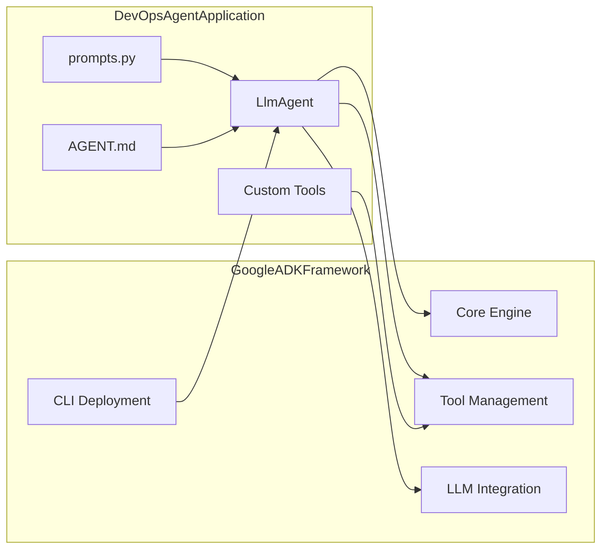
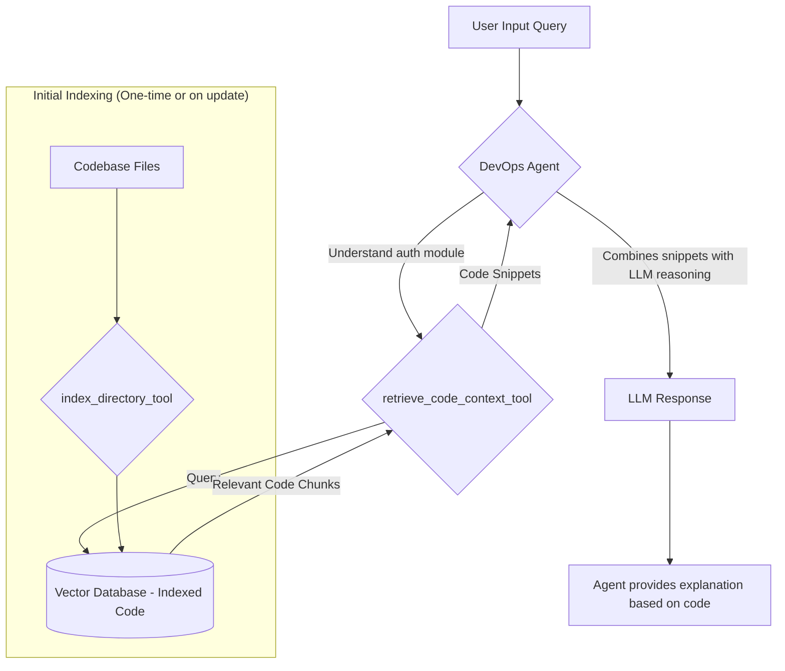
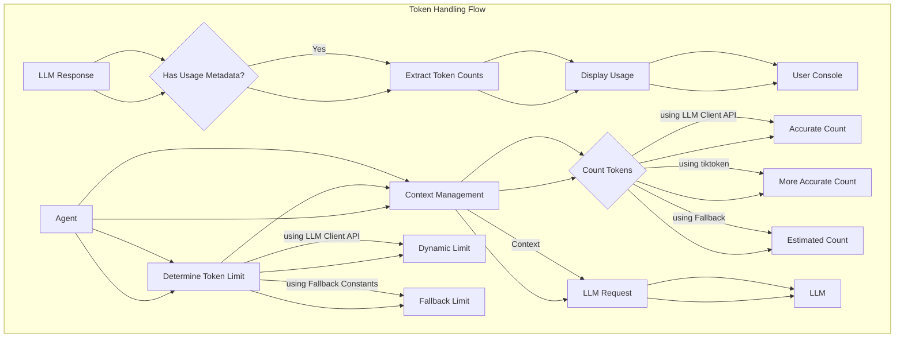
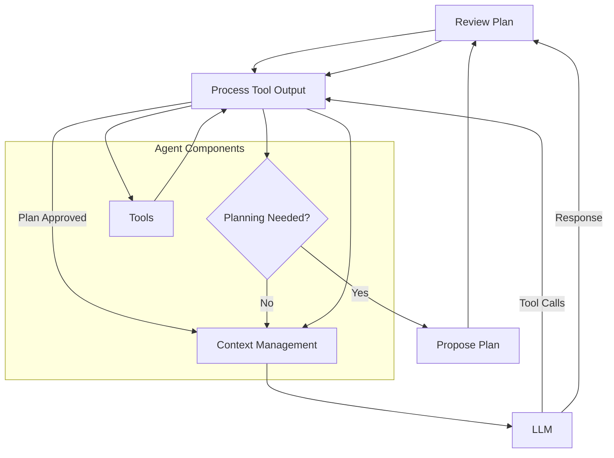
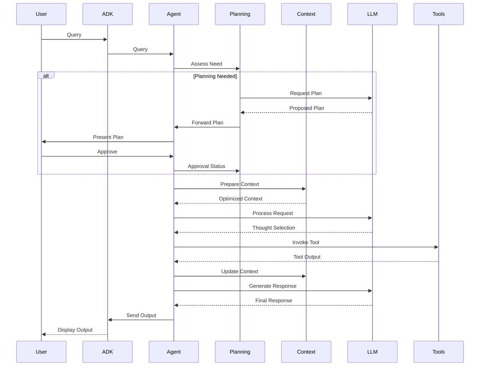

# DevOps Agent

## Overview

The DevOps Agent is a sophisticated AI assistant built using the Google Agent Development Kit (ADK). It is designed to help developers and DevOps engineers with a wide range of tasks related to software development lifecycle, infrastructure management, and operational excellence. The agent leverages Large Language Models (LLMs) and a suite of specialized tools to understand user requests, interact with codebases, execute commands, and automate complex workflows.

## Features

*   **CI/CD Automation:** Assists in setting up, managing, and troubleshooting continuous integration and continuous delivery pipelines.
*   **Infrastructure Management:** Helps with provisioning, configuring, and managing infrastructure resources.
*   **Codebase Understanding:** Can index and analyze code repositories to answer questions about functionality, find relevant snippets, and assist with refactoring.
*   **Workflow Automation:** Automates repetitive DevOps tasks through a combination of LLM reasoning and tool execution.
*   **Interactive Planning:** Supports an interactive planning workflow for complex tasks, allowing users to review and approve the agent's proposed approach before execution. See the [Interactive Planning Workflow](#interactive-planning-workflow) section for details.
*   **Comprehensive Tool Integration:** Equipped with a versatile suite of tools enabling interaction with the environment. This includes core file system operations (reading, writing, listing, editing), powerful code search capabilities (`grep_search` for patterns, `file_search` for paths), secure shell command execution (`execute_vetted_shell_command` with vetting and user approval), codebase indexing and retrieval (`index_directory_tool`, `retrieve_code_context_tool` for RAG), and web research (`google_search_grounding`). The agent can intelligently utilize common DevOps command-line tools found in the user's environment (like `git`, `docker`, `kubectl`, `terraform`) based on availability and context.
*   **Context Management and Token Optimization:** Implements a structured approach to managing conversation history, relevant code snippets, and tool outputs. This system prioritizes key information and employs token counting strategies (including leveraging the LLM client's capabilities, `tiktoken` if available, and fallback methods) to stay within model context limits while maintaining high-quality context for the LLM.
*   **LLM Usage Transparency:** Displays and logs token usage for each model interaction (prompt, candidate, total), providing clear insight into the cost and complexity of agent responses.
*   **Proactive & Safe Tool Usage:** Intelligently discovers available command-line tools and executes shell commands with a strong emphasis on safety, including pre-vetting and user approval for state-changing operations.
*   **Rich Interactive Loop:** Powered by the ADK's `LlmAgent`, enabling complex, multi-turn conversations and sophisticated tool usage.
*   **Enhanced Tool Execution Feedback:** Provides clear console output detailing tool arguments, execution status (success/failure), duration, and results or errors.
*   **Granular Error Reporting:** Offers detailed error messages for failed tool executions and unhandled agent exceptions, including relevant context like command executed, return codes, and stderr/stdout for shell commands.
*   **Robust Agent Lifecycle:** The ADK provides a stable framework for agent execution, state management, and error handling.
*   **Interactive CLI:** Allows users to interact with the agent through a command-line interface.
*   **Cloud Deployment:** Can be deployed as a service on Google Cloud Run.
*   **Extensible:** Built on the Google ADK, allowing for customization and extension with new tools and capabilities.

## Quickstart

To get started with the DevOps Agent, you can use `uvx` to handle dependencies and run the agent without needing to install the Google ADK globally.

1.  **Run the Agent Locally:**
    *Important:* Make sure you have set the `GOOGLE_API_KEY` environment variable with your Google API key:

    ```bash
    export GOOGLE_API_KEY=your_api_key_here
    ```

    This is required for the agent to create a GenAI client when running with the ADK. The key is loaded via the configuration system in `config.py`.

    Use the following command from the root of the repository to run the agent locally with the necessary dependencies and a workaround for a compatibility issue:
    
    ```bash
    PROTOCOL_BUFFERS_PYTHON_IMPLEMENTATION=python uvx --with extensions --with google-generativeai --with google-api-core --with chromadb --with protobuf --with openai --with tiktoken --no-cache --python 3.13 --from git+https://github.com/BlueCentre/adk-python.git@main adk run devops
    ```
    
    *Note:* The `PROTOCOL_BUFFERS_PYTHON_IMPLEMENTATION=python` part is a workaround for a compatibility issue between recent `protobuf` versions and older pre-compiled code in some dependencies (`chromadb` via `opentelemetry` components).

    This command will set up a virtual environment with the required packages and start an interactive CLI session with the DevOps agent.

2.  **Deploy to Google Cloud Run:**
    The agent can be deployed as a service to Google Cloud Run.

    ```bash
    adk deploy cloud_run --project=[YOUR_GCP_PROJECT] --region=[YOUR_GCP_REGION] Agents/devops/
    ```
    Replace `[YOUR_GCP_PROJECT]` and `[YOUR_GCP_REGION]` with your Google Cloud project ID and desired region. This command packages the agent and deploys it, making it accessible via an HTTP endpoint.

## Technical Design

The DevOps Agent is architected as an `LlmAgent` within the Google ADK framework. Its core components are:

*   **`agent.py`:** This is the main file that defines the agent class (`MyDevopsAgent`), inheriting from the ADK's `LlmAgent`. It initializes the agent with the LLM model, instructions, and tools. Crucially, it integrates the `PlanningManager` to handle interactive planning and utilizes the context management system to prepare relevant input for the LLM. It also defines custom callback handlers (`handle_before_model`, `handle_after_model`, etc.) to manage the agent's state, process tool outputs, and provide interactive feedback, including handling the planning workflow and integrating with context management.
*   **`prompts.py`:** Contains the core instructions and persona definition for the LLM, guiding its behavior, capabilities, and how it should interact with users and tools. It works in conjunction with `AGENT.md` (located in the agent's operational directory, e.g., `./devops/AGENT.md`) which provides detailed operational context, tool availability, and workflow procedures.
*   **Tools:** A collection of Python functions that the agent can invoke to perform specific actions. These tools are the agent's interface to the external world (e.g., reading files, running commands, searching code).
*   **Context Management (`context_management/`):** This module is responsible for maintaining a rich and optimized context for the LLM. It manages the history of the conversation, tracks relevant code snippets identified during interactions (e.g., via file reads or edits), and processes tool outputs to include key information concisely. It incorporates logic for accurate token counting and prioritizes information to ensure the context stays within model context limits. See the [Token Counting and Management](#token-counting-and-management) section for details on token handling.
*   **Planning Manager (`components/planning_manager.py`):** This component orchestrates the interactive planning process. Based on the user's request and the agent's state, it can trigger the generation of a proposed plan by the LLM. It then manages the interaction with the user for plan approval or refinement before allowing the agent to proceed with the implementation phase. See the [Interactive Planning Workflow](#interactive-planning-workflow) section for a detailed explanation of the workflow.
*   **Google ADK Framework:** Provides the underlying machinery for agent execution, tool management, LLM interaction, session management, and deployment.

### Relation to Google ADK Framework

The DevOps Agent is fundamentally an application built *on top of* the Google ADK. The ADK provides the core capabilities that make the agent functional:

*   **Agent Abstraction (`LlmAgent`):** This is a cornerstone of the ADK. It's a high-level class for creating LLM-powered agents, handling the complexities of LLM interaction, prompt construction, tool dispatch, and managing the state of the conversation. This abstraction is key to enabling a **rich and robust interactive agent loop**, allowing for sophisticated multi-turn dialogues and intelligent tool chaining.
*   **Tool Management:** A system for defining, registering, and securely invoking tools that the agent can use.
*   **LLM Integration:** Connectors and configurations for various LLMs, allowing developers to choose the model that best suits their needs.
*   **CLI and Deployment:** Utilities for running agents locally (`adk run`) and deploying them to cloud environments like Google Cloud Run (`adk deploy cloud_run`).
*   **Session Management:** (Optional) Capabilities to persist and resume agent conversations.
*   **Observability:** (Optional) Integration with tracing and logging for monitoring agent behavior. This agent leverages this by logging detailed information about tool execution (including duration) and LLM token usage.

### Callback Usage in `MyDevopsAgent`

The `MyDevopsAgent` class, which inherits from the ADK's `LlmAgent`, makes extensive use of the ADK's callback mechanism to customize its behavior at specific points in the agent's execution lifecycle. This is a core aspect of its integration with the ADK framework.

**How it Works:**

1.  **Callback Registration:** In its `__init__` method, `MyDevopsAgent` assigns its own custom methods (e.g., `self.handle_before_model`, `self.handle_after_model`, `self.handle_before_tool`, `self.handle_after_tool`) to the corresponding callback attributes provided by the `LlmAgent` base class (e.g., `self.before_model_callback`, `self.after_model_callback`). This is the standard and recommended way to register callbacks in ADK.

2.  **Custom Logic in Callback Handlers:** These custom handler methods contain the specialized logic for `MyDevopsAgent`, including:
    *   **State Management:** Interacting with `callback_context.state` and `tool_context.state` to manage conversation history, tool invocation details, and other contextual information.
    *   **Planning Integration:** The `PlanningManager` is invoked within these callbacks (primarily `handle_before_model` and `handle_after_model`) to interject planning steps. This manager can return specific ADK objects (like `LlmResponse`) to control the execution flow, such as skipping an LLM call if a plan is being presented or replacing an LLM response if the output is a plan.
    *   **Context Manipulation:** Modifying the `LlmRequest` object in `handle_before_model` to inject assembled context before it's sent to the LLM.
    *   **UI Feedback:** Interacting with UI components (console, status spinners) to provide real-time feedback to the user.

**Alignment with ADK Recommendations:**

This approach is well-aligned with the ADK framework's design for callbacks. The ADK allows any callable (standalone functions or instance methods) to be registered as a callback. For a complex and stateful agent like `MyDevopsAgent`, defining callbacks as methods within the agent's own class offers several advantages:

*   **Encapsulation:** Keeps agent-specific logic contained within the agent class.
*   **State Access:** Allows callbacks to easily access and modify the agent's internal state and components (like `_planning_manager`).
*   **Organization:** Groups related pre-processing and post-processing logic with the agent definition.

Instead of being an abstraction *diverging* from ADK's callback system, `MyDevopsAgent` *leverages* the callback system by providing its own sophisticated implementations for the callback hooks. This demonstrates a robust use of the ADK's extensibility points to build a specialized agent.



In essence, the ADK provides the "operating system" for the agent, while `agent.py`, `prompts.py`, `AGENT.md`, and the custom tools define the specific "application" logic and capabilities of the DevOps Agent. This separation allows developers to focus on the unique aspects of their agent without needing to rebuild common agent infrastructure.

## Codebase Indexing and Retrieval

A key feature of this DevOps agent is its ability to understand and interact with codebases:

1.  **`index_directory_tool`:** This tool is used to scan a specified directory (e.g., a Git repository). It processes supported file types, breaks them into manageable chunks, generates vector embeddings for these chunks, and stores them in a vector database (ChromaDB). This creates a semantic index of the codebase.
2.  **`retrieve_code_context_tool`:** When the agent needs to understand a part of the codebase to answer a question or perform a task, it uses this tool. It takes a natural language query, converts it to an embedding, and searches the vector database for the most similar (relevant) code chunks.

This RAG (Retrieval Augmented Generation) approach allows the agent to ground its responses and actions in the actual content of the codebase, leading to more accurate and context-aware assistance.
*Note: To ensure the codebase understanding remains accurate, the indexed directory should be re-indexed using `index_directory_tool` with `force_reindex=True` after any significant code modifications.*



This mechanism significantly enhances the agent's ability to act as a knowledgeable assistant for development-related queries.

## Token Counting and Management

Managing token usage is essential for efficient and cost-effective interactions with Large Language Models. The DevOps Agent implements several strategies to handle this:

1.  **Dynamic Token Limit Determination:** The agent attempts to dynamically fetch the actual token limit for the configured LLM model using the LLM client's capabilities. If this fails, it falls back to predefined limits based on common model types (e.g., Gemini Flash, Gemini Pro).
2.  **Token Usage Transparency:** For each model response, the agent displays detailed token usage statistics (prompt, candidate, and total tokens) using the `ui_utils.display_model_usage` function, providing users with insight into the cost of interactions.
3.  **Context Token Counting:** The `context_management/context_manager.py` component is designed to accurately count tokens for the conversation history and injected context. It includes logic to utilize native LLM client counting methods or the `tiktoken` library if available.
4.  **Context Optimization:** The context management logic aims to optimize the information sent to the LLM to stay within token limits while retaining relevant conversation history and code snippets. This now primarily leverages the `context.state` mechanism provided by the ADK for storing and retrieving this information.
5.  ~~**Placeholder/Fallback Counters:** Basic placeholder token counting methods are available in `devops_agent.py` (`_count_tokens`, `_count_context_tokens`). These are used as a fallback if the more sophisticated counting mechanisms are not fully functional, ensuring the agent can still operate and provide some level of token estimation, albeit less accurate.~~

The goal is to ensure token usage is transparent, context is managed effectively to avoid exceeding limits, and the most accurate available counting methods are utilized.



## Interactive Planning Workflow

The DevOps Agent includes an interactive planning phase to improve collaboration and the quality of output for complex tasks. This workflow is triggered for requests deemed sufficiently complex or when the user explicitly asks for a plan.

**Workflow Steps:**

1.  **Task Assessment:** Upon receiving a user request, the agent assesses its complexity to determine if a planning phase is beneficial.
2.  **Plan Proposal:** If planning is needed, the agent uses the LLM to generate a detailed, multi-step plan outlining the proposed approach to fulfill the request.
3.  **User Review:** The agent presents the generated plan to the user.
4.  **Approval or Refinement:** The user can review the plan and either approve it to proceed or provide feedback for refinement. The agent can iterate on the plan based on user feedback.
5.  **Implementation:** Once the plan is approved by the user, the agent proceeds with executing the steps outlined in the plan, leveraging its tools and context management.

This interactive approach ensures that the agent and the user are aligned on the strategy before significant work is performed, reducing rework and improving the final outcome.

### Agent Interaction Flow



**Explanation:**

1.  **User Input:** The user interacts with the agent, typically via the ADK CLI (`adk run`) or an API endpoint if deployed.
2.  **Agent Decision:** The agent determines if a planning step is needed based on the complexity of the task.
3.  **Propose Plan:** If planning is needed, the agent generates a detailed plan.
4.  **Review Plan:** The user reviews the proposed plan.
5.  **Approve Plan:** The user approves the plan.
6.  **Context Management:** The agent prepares the context for the LLM, including relevant code snippets and tool outputs.
7.  **LLM:** The LLM processes the input, "thinks" about the request, and decides if a tool needs to be used. It might select one or more tools from the agent's toolset.
8.  **Tool Invocation:** If a tool is selected, the `LlmAgent` invokes the corresponding Python function (e.g., `read_file_content`, `execute_vetted_shell_command`).
9.  **Tool Output:** The tool executes and returns its output to the `LlmAgent`.
10. **Process Tool Output:** The agent processes the tool output and integrates it with the context.
11. **LLM Response Generation:** The agent sends the processed output back to the LLM, which then formulates the final response to the user.
12. **User Output:** The ADK framework delivers the agent's response to the user.

## Agent Interaction Sequence Diagram

