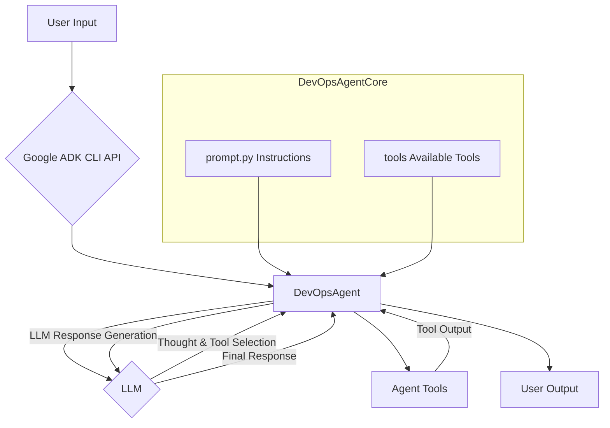
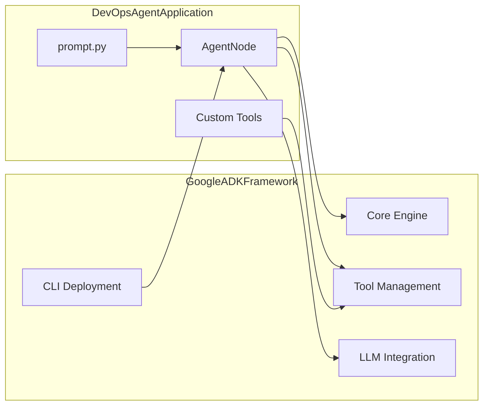
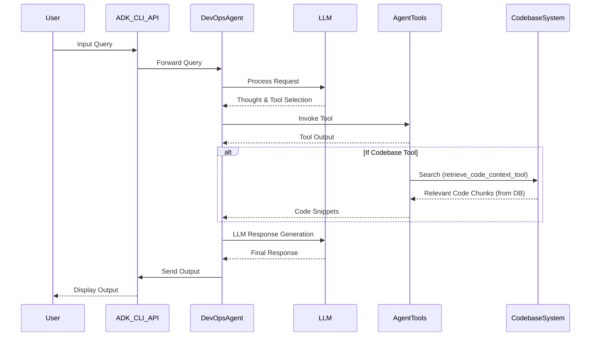

# DevOps Agent

## Overview

The DevOps Agent is a sophisticated AI assistant built using the Google Agent Development Kit (ADK). It is designed to help developers and DevOps engineers with a wide range of tasks related to software development lifecycle, infrastructure management, and operational excellence. The agent leverages Large Language Models (LLMs) and a suite of specialized tools to understand user requests, interact with codebases, execute commands, and automate complex workflows.

## Features

*   **CI/CD Automation:** Assists in setting up, managing, and troubleshooting continuous integration and continuous delivery pipelines.
*   **Infrastructure Management:** Helps with provisioning, configuring, and managing infrastructure resources.
*   **Codebase Understanding:** Can index and analyze code repositories to answer questions about functionality, find relevant snippets, and assist with refactoring.
*   **Workflow Automation:** Automates repetitive DevOps tasks through a combination of LLM reasoning and tool execution.
*   **Tool Integration:** Comes equipped with a rich set of tools for file system operations, code search (ripgrep), shell command execution, and web interaction (Playwright).
*   **Rich Interactive Loop:** Powered by the ADK's `LlmAgent`, enabling complex, multi-turn conversations and sophisticated tool usage.
*   **Enhanced Tool Execution Feedback:** Provides clear console output detailing tool arguments, execution status (success/failure), duration, and results or errors.
*   **Granular Error Reporting:** Offers detailed error messages for failed tool executions and unhandled agent exceptions, including relevant context like command executed, return codes, and stderr/stdout for shell commands.
*   **LLM Usage Transparency:** Displays and logs token usage for each model interaction, providing insight into the cost and complexity of agent responses.
*   **Robust Agent Lifecycle:** The ADK provides a stable framework for agent execution, state management, and error handling.
*   **Interactive CLI:** Allows users to interact with the agent through a command-line interface.
*   **Cloud Deployment:** Can be deployed as a service on Google Cloud Run.
*   **Extensible:** Built on the Google ADK, allowing for customization and extension with new tools and capabilities.

## Quickstart

To get started with the DevOps Agent, you can use `uvx` to handle dependencies and run the agent without needing to install the Google ADK globally.

1.  **Run the Agent Locally:**
    Use the following command from the root of the repository to run the agent locally with the necessary dependencies and a workaround for a compatibility issue:
    
    ```bash
    PROTOCOL_BUFFERS_PYTHON_IMPLEMENTATION=python uvx --with extensions --with google-generativeai --with google-api-core --with chromadb --with protobuf --with openai --with tiktoken --no-cache --python 3.13 --from git+https://github.com/BlueCentre/adk-python.git@main adk run devops
    ```
    
    *Note:* The `PROTOCOL_BUFFERS_PYTHON_IMPLEMENTATION=python` part is a workaround for a compatibility issue between recent `protobuf` versions and older pre-compiled code in some dependencies (`chromadb` via `opentelemetry` components).

    *Important:* Make sure you have set the `GOOGLE_API_KEY` environment variable with your Google API key:

    ```bash
    export GOOGLE_API_KEY=your_api_key_here
    ```

    This is required for the agent to create a GenAI client when running with the ADK. The key is loaded via the configuration system in `config.py`.

    This command will set up a virtual environment with the required packages and start an interactive CLI session with the DevOps agent.

2.  **Deploy to Google Cloud Run:**
    The agent can be deployed as a service to Google Cloud Run.

    ```bash
    adk deploy cloud_run --project=[YOUR_GCP_PROJECT] --region=[YOUR_GCP_REGION] Agents/devops/
    ```
    Replace `[YOUR_GCP_PROJECT]` and `[YOUR_GCP_REGION]` with your Google Cloud project ID and desired region. This command packages the agent and deploys it, making it accessible via an HTTP endpoint.

## Technical Design

The DevOps Agent is architected as an `LlmAgent` within the Google ADK framework. Its core components are:

*   **`agent.py`:** This is the main file that defines the agent. It initializes the `LlmAgent` with:
    *   A specific LLM model (e.g., Gemini).
    *   A name and description.
    *   Detailed instructions defined in `prompt.py`.
    *   A collection of tools available to the agent (filesystem tools, code indexing, shell execution, etc.).
    *   Configuration for content generation.
    It also defines custom callback handlers (`handle_before_model`, `handle_after_model`, `handle_before_tool`, `handle_after_tool`) to provide rich, interactive feedback during model and tool interactions.
*   **`prompt.py`:** Contains the core instructions and persona definition for the LLM, guiding its behavior, capabilities, and how it should interact with users and tools.
*   **Tools:** A collection of Python functions that the agent can invoke to perform specific actions. These tools are the agent's interface to the external world (e.g., reading files, running commands, searching code).
*   **Google ADK Framework:** Provides the underlying machinery for agent execution, tool management, LLM interaction, session management, and deployment.

### Agent Interaction Flow



**Explanation:**

1.  **User Input:** The user interacts with the agent, typically via the ADK CLI (`adk run`) or an API endpoint if deployed.
2.  **ADK Framework:** The ADK receives the input and routes it to the configured DevOps Agent.
3.  **DevOps Agent (`LlmAgent`):** The agent, using its instructions from `prompt.py` and the user query, consults the LLM.
4.  **LLM:** The LLM processes the input, "thinks" about the request, and decides if a tool needs to be used. It might select one or more tools from the agent's toolset.
5.  **Tool Invocation:** If a tool is selected, the `LlmAgent` invokes the corresponding Python function (e.g., `read_file_content`, `execute_vetted_shell_command`).
6.  **Tool Output:** The tool executes and returns its output to the `LlmAgent`.
7.  **LLM Response Generation:** The agent sends the tool output (if any) back to the LLM, which then formulates the final response to the user.
8.  **User Output:** The ADK framework delivers the agent's response to the user.

### Relation to Google ADK Framework

The DevOps Agent is fundamentally an application built *on top of* the Google ADK. The ADK provides the core capabilities that make the agent functional:

*   **Agent Abstraction (`LlmAgent`):** This is a cornerstone of the ADK. It's a high-level class for creating LLM-powered agents, handling the complexities of LLM interaction, prompt construction, tool dispatch, and managing the state of the conversation. This abstraction is key to enabling a **rich and robust interactive agent loop**, allowing for sophisticated multi-turn dialogues and intelligent tool chaining.
*   **Tool Management:** A system for defining, registering, and securely invoking tools that the agent can use.
*   **LLM Integration:** Connectors and configurations for various LLMs, allowing developers to choose the model that best suits their needs.
*   **CLI and Deployment:** Utilities for running agents locally (`adk run`) and deploying them to cloud environments like Google Cloud Run (`adk deploy cloud_run`).
*   **Session Management:** (Optional) Capabilities to persist and resume agent conversations.
*   **Observability:** (Optional) Integration with tracing and logging for monitoring agent behavior. This agent leverages this by logging detailed information about tool execution (including duration) and LLM token usage.



In essence, the ADK provides the "operating system" for the agent, while `agent.py`, `prompt.py`, and the custom tools define the specific "application" logic and capabilities of the DevOps Agent. This separation allows developers to focus on the unique aspects of their agent without needing to rebuild common agent infrastructure.

## Codebase Indexing and Retrieval

A key feature of this DevOps agent is its ability to understand and interact with codebases:

1.  **`index_directory_tool`:** This tool is used to scan a specified directory (e.g., a Git repository). It processes supported file types, breaks them into manageable chunks, generates vector embeddings for these chunks, and stores them in a vector database (ChromaDB). This creates a semantic index of the codebase.
2.  **`retrieve_code_context_tool`:** When the agent needs to understand a part of the codebase to answer a question or perform a task, it uses this tool. It takes a natural language query, converts it to an embedding, and searches the vector database for the most similar (relevant) code chunks.

This RAG (Retrieval Augmented Generation) approach allows the agent to ground its responses and actions in the actual content of the codebase, leading to more accurate and context-aware assistance.


This mechanism significantly enhances the agent's ability to act as a knowledgeable assistant for development-related queries.

## Agent Interaction Sequence Diagram

