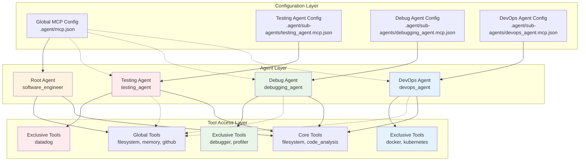
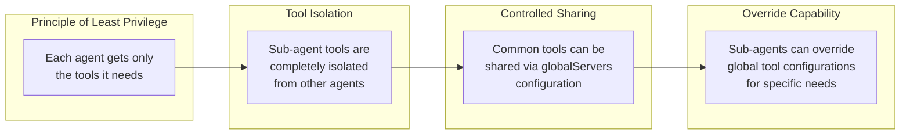
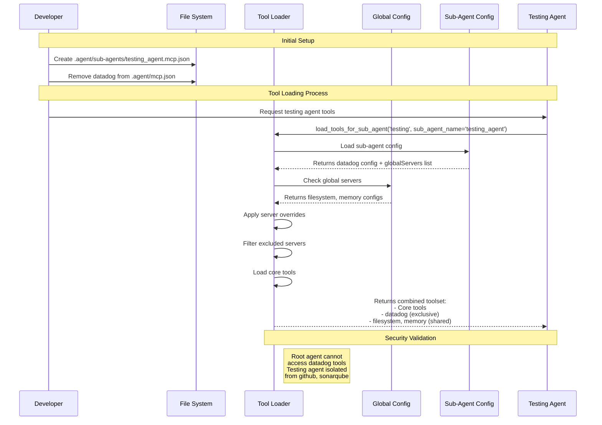

# Per-Sub-Agent MCP Configuration Guide

## Overview

This guide explains how to configure MCP tools for specific sub-agents while maintaining proper isolation from the root agent. This ensures that sub-agents only have access to their designated tools plus selected global tools.

## Architecture Overview

The per-sub-agent MCP tool loading system implements a hierarchical configuration approach that provides security isolation while enabling controlled sharing of common tools.



### Security Model



## Configuration Structure

### Global MCP Configuration (`.agent/mcp.json`)
- **Purpose**: Tools available to the root agent and potentially shared with sub-agents
- **Access**: Root agent + any sub-agent that includes them via `globalServers`
- **Examples**: `filesystem`, `memory`, `github`, `sonarqube`

### Sub-Agent MCP Configuration (`.agent/sub-agents/{sub_agent_name}.mcp.json`)
- **Purpose**: Tools exclusive to a specific sub-agent
- **Access**: Only the specified sub-agent
- **Examples**: `datadog` for testing agent, `debugger` for debugging agent

#### Enhanced Agent Fallback Logic
Enhanced agents (those with names starting with `enhanced_`) automatically fall back to base agent configurations:
- `enhanced_devops_agent` → falls back to `devops_agent.mcp.json`
- `enhanced_testing_agent` → falls back to `testing_agent.mcp.json`

This allows enhanced agents to inherit the same MCP tool configurations as their base counterparts without duplicating configuration files.

## Configuration Format

### Sub-Agent MCP Configuration File
```json
{
  "mcpServers": {
    "tool_name": {
      "command": "npx",
      "args": ["-y", "@package/mcp-server"],
      "env": {
        "API_KEY": "{{env.API_KEY}}"
      }
    }
  },
  "globalServers": ["filesystem", "memory"],
  "excludedServers": ["github", "sonarqube"],
  "serverOverrides": {
    "tool_name": {
      "env": {
        "TEST_MODE": "1"
      }
    }
  }
}
```

### Configuration Fields

- **`mcpServers`**: Sub-agent specific MCP tools (exclusive to this sub-agent)
- **`globalServers`**: Global MCP tools to include for this sub-agent
- **`excludedServers`**: Global MCP tools to exclude for this sub-agent
- **`serverOverrides`**: Custom configuration overrides for specific servers

## Example: Testing Agent with Datadog

### Problem
You want the testing agent to have access to Datadog monitoring tools, but don't want the root agent or other sub-agents to have access to these tools.

### Solution
1. **Remove from global config** (`.agent/mcp.json`):
   ```json
   {
     "mcpServers": {
       // Remove datadog from here
       "filesystem": { ... },
       "memory": { ... }
     }
   }
   ```

2. **Create sub-agent config** (`.agent/sub-agents/testing_agent.mcp.json`):
   ```json
   {
     "mcpServers": {
       "datadog": {
         "command": "npx",
         "args": ["-y", "@winor30/mcp-server-datadog"],
         "env": {
           "DATADOG_API_KEY": "{{env.DATADOG_API_KEY}}",
           "DATADOG_APP_KEY": "{{env.DATADOG_APP_KEY}}",
           "DATADOG_SITE": "{{env.DATADOG_SITE}}"
         },
         "suppress_output": true
       }
     },
     "globalServers": ["filesystem", "memory"],
     "excludedServers": ["github", "sonarqube", "playwright"]
   }
   ```

### Result
- **Root agent**: Has access to `filesystem`, `memory`, `github`, `sonarqube`, `playwright`
- **Testing agent**: Has access to `datadog` (exclusive) + `filesystem`, `memory` (shared)
- **Other sub-agents**: No access to `datadog` tools

### Configuration Process Sequence



## Common Use Cases

### 1. Debugging Agent with Specialized Tools
```json
// .agent/sub-agents/debugging_agent.mcp.json
{
  "mcpServers": {
    "debugger": {
      "command": "npx",
      "args": ["@debugging/mcp-server"]
    },
    "profiler": {
      "command": "python",
      "args": ["-m", "profiler_server"]
    }
  },
  "globalServers": ["filesystem"],
  "excludedServers": ["github", "sonarqube"]
}
```

### 2. Security Agent with Restricted Access
```json
// .agent/sub-agents/security_agent.mcp.json
{
  "mcpServers": {
    "security-scanner": {
      "command": "npx",
      "args": ["@security/mcp-scanner"]
    }
  },
  "globalServers": ["filesystem"],
  "excludedServers": ["github", "sonarqube", "playwright"],
  "serverOverrides": {
    "filesystem": {
      "env": {
        "READ_ONLY": "1"
      }
    }
  }
}
```

### 3. DevOps Agent with Infrastructure Tools
```json
// .agent/sub-agents/devops_agent.mcp.json
{
  "mcpServers": {
    "docker": {
      "command": "npx",
      "args": ["@docker/mcp-server"]
    },
    "kubernetes": {
      "command": "kubectl",
      "args": ["mcp-server"]
    }
  },
  "globalServers": ["filesystem", "github"],
  "excludedServers": ["memory"]
}
```

## Best Practices

### 1. Principle of Least Privilege
- Only give sub-agents access to tools they specifically need
- Use `excludedServers` to prevent access to unnecessary global tools
- Regularly review and audit tool access

### 2. Naming Conventions
- Use descriptive names for MCP servers: `datadog`, `debugger`, `security-scanner`
- Keep sub-agent config files named consistently: `{sub_agent_name}.mcp.json`

### 3. Environment Variables
- Use environment variables for sensitive data: `"{{env.API_KEY}}"`
- Set `suppress_output: true` for noisy MCP servers
- Use `serverOverrides` to customize behavior per sub-agent

### 4. Testing Configuration
```bash
# Test root agent tools
uv run python -c "
from agents.software_engineer.tools import load_all_tools_and_toolsets
tools = load_all_tools_and_toolsets()
print(f'Root agent: {len(tools)} tools')
"

# Test sub-agent tools
uv run python -c "
from agents.software_engineer.tools import load_tools_for_sub_agent
tools = load_tools_for_sub_agent('testing', sub_agent_name='testing_agent')
print(f'Testing agent: {len(tools)} tools')
"
```

## Troubleshooting

### Root Agent Has Access to Sub-Agent Tools
**Problem**: Root agent can see tools that should be sub-agent exclusive.
**Solution**: Move the MCP tool configuration from `.agent/mcp.json` to `.agent/sub-agents/{sub_agent_name}.mcp.json`.

### Sub-Agent Can't Access Expected Tools
**Problem**: Sub-agent missing expected tools.
**Solution**: 
1. Check that the sub-agent configuration file exists
2. Verify `globalServers` includes needed global tools
3. Check that tools aren't in `excludedServers`

### MCP Server Connection Issues
**Problem**: MCP server fails to connect.
**Solution**:
1. Verify environment variables are set correctly
2. Check MCP server package is installed
3. Review server logs for connection errors

### Enhanced Agent Configuration Not Loading
**Problem**: Enhanced agent (e.g., `enhanced_devops_agent`) not loading expected MCP tools.
**Solution**:
1. Check if base configuration file exists (e.g., `devops_agent.mcp.json`)
2. Verify the enhanced agent name follows the `enhanced_` prefix pattern
3. Check logs for fallback configuration messages:
   ```
   INFO: Using fallback config file for enhanced_devops_agent: /path/.agent/sub-agents/devops_agent.mcp.json
   ```

## API Reference

### Functions
- `load_tools_for_sub_agent(profile, custom_config, sub_agent_name)`
- `get_sub_agent_mcp_config(sub_agent_name)`
- `list_available_mcp_servers(sub_agent_name)`
- `create_sub_agent_mcp_config(sub_agent_name, mcp_servers, ...)`

### Configuration Management
```python
from agents.software_engineer.tools import (
    create_sub_agent_mcp_config,
    get_sub_agent_mcp_config,
    list_available_mcp_servers
)

# Create configuration programmatically
create_sub_agent_mcp_config(
    sub_agent_name="testing_agent",
    mcp_servers={"datadog": {...}},
    global_servers=["filesystem", "memory"],
    excluded_servers=["github"]
)

# Check current configuration
config = get_sub_agent_mcp_config("testing_agent")
available = list_available_mcp_servers("testing_agent")
```

## Verification

Use the verification script to check that your configuration is working correctly:

```bash
uv run scripts/validation/verify_mcp_separation.py
```

This will show exactly which tools each agent has access to and verify proper isolation.

## Configuration Decision Flow

```mermaid
graph TD
    Start[Need MCP Tool Access] --> Question1{Tool needed by<br/>multiple agents?}
    
    Question1 -- Yes --> GlobalConfig[Add to Global Config<br/>.agent/mcp.json]
    Question1 -- No --> Question2{Single sub-agent<br/>exclusive access?}
    
    Question2 -- Yes --> SubConfig[Add to Sub-Agent Config<br/>.agent/sub-agents/{agent}.mcp.json]
    Question2 -- No --> Question3{Some agents need it<br/>others don't?}
    
    Question3 -- Yes --> HybridConfig[Hybrid Approach]
    Question3 -- No --> GlobalConfig
    
    subgraph "Hybrid Configuration"
        HybridConfig --> HC1[Add to Global Config]
        HC1 --> HC2[Add excludedServers to<br/>sub-agents that don't need it]
    end
    
    subgraph "Security Considerations"
        GlobalConfig --> Security1{Security sensitive?}
        SubConfig --> Security2{Needs access control?}
        HC2 --> Security3{Proper exclusions set?}
        
        Security1 -- Yes --> RestrictAccess[Consider sub-agent<br/>exclusive instead]
        Security1 -- No --> SafeGlobal[Safe for global use]
        
        Security2 -- Yes --> SecurityPolicy[Set security policy<br/>in sub-agent config]
        Security2 -- No --> StandardConfig[Use standard config]
        
        Security3 -- No --> ReviewExclusions[Review and update<br/>exclusion lists]
        Security3 -- Yes --> SecureHybrid[Secure hybrid setup]
    end
    
    subgraph "Final Validation"
        SafeGlobal --> Validate[Run verification script]
        StandardConfig --> Validate
        SecurityPolicy --> Validate
        SecureHybrid --> Validate
        RestrictAccess --> Validate
        ReviewExclusions --> Validate
        
        Validate --> ValidationResult{All tests pass?}
        ValidationResult -- No --> DebugConfig[Debug configuration]
        ValidationResult -- Yes --> Complete[Configuration Complete]
        
        DebugConfig --> CheckLogs[Check tool loading logs]
        CheckLogs --> FixIssues[Fix identified issues]
        FixIssues --> Validate
    end
    
    style GlobalConfig fill:#e3f2fd
    style SubConfig fill:#ffebee
    style HybridConfig fill:#e8f5e8
    style Complete fill:#f1f8e9
    style DebugConfig fill:#fff3e0
```

## Best Practices Summary

1. **Start with security**: Determine if tools should be globally accessible or restricted to specific sub-agents
2. **Use the verification script**: Always validate your configuration after changes
3. **Document your decisions**: Keep track of why certain tools are configured for specific agents
4. **Test isolation**: Ensure that sensitive tools are properly isolated from unintended agents
5. **Review regularly**: Periodically audit tool access to ensure it still meets your security requirements

This configuration approach ensures clean separation between root agent and sub-agent tools while maintaining flexibility for sharing common tools. 