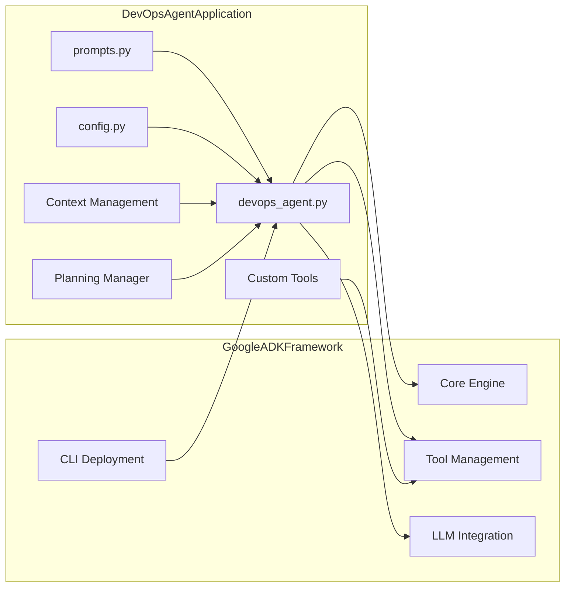
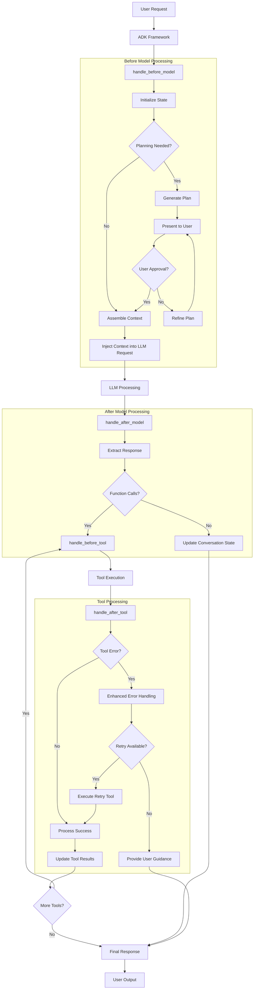
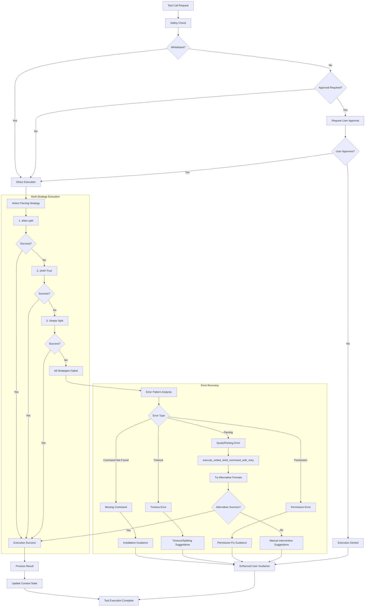
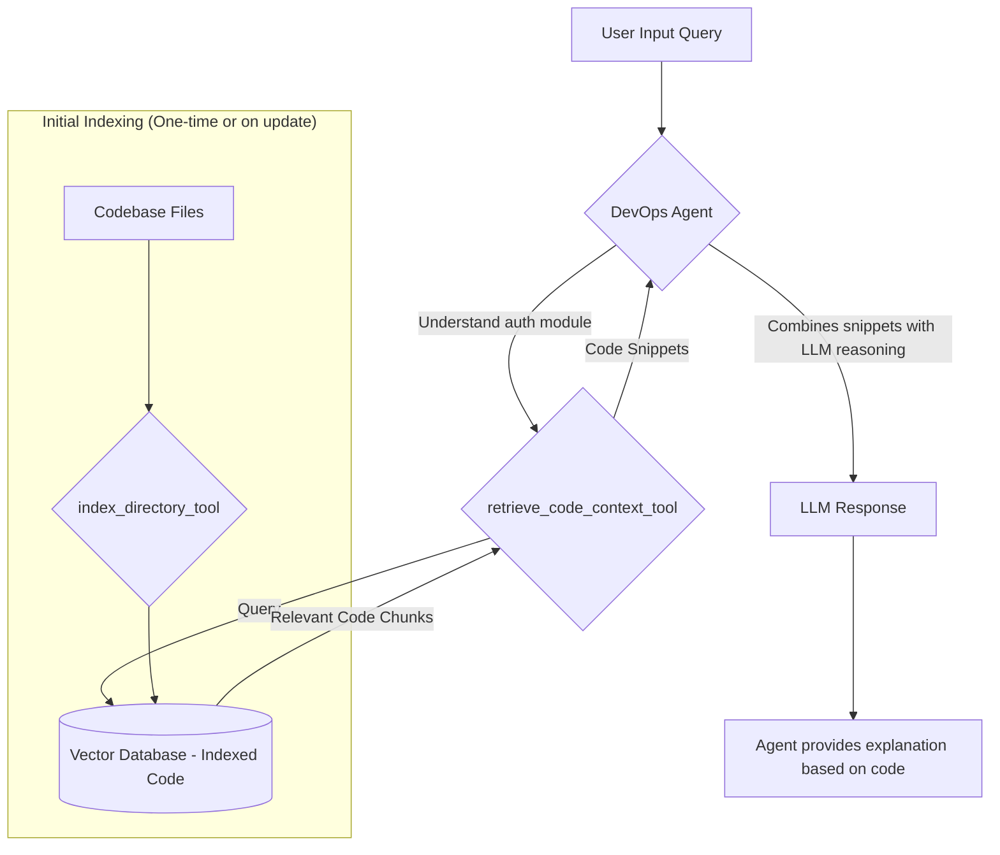
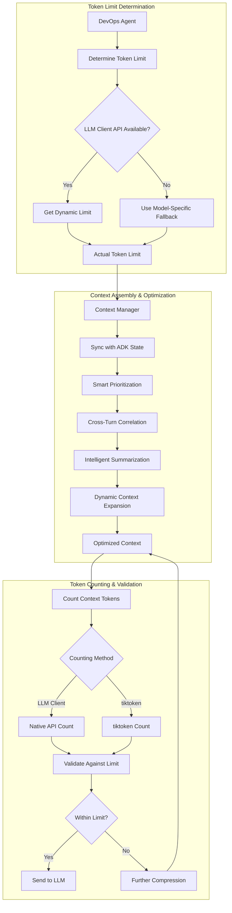

# Architecture Overview

The DevOps Agent implements a sophisticated, multi-layered architecture that builds upon the Google ADK framework to deliver advanced planning, context management, and codebase understanding capabilities. This design emphasizes performance, safety, and a superior developer experience.

## Google ADK Framework Integration



The main components are organized as follows:

```
devops/
├── devops_agent.py           # Main agent implementation (ADK LlmAgent)
├── components/
│   ├── planning_manager.py   # Interactive planning workflow
│   └── context_management/   # Advanced context intelligence
│       ├── smart_prioritization.py     # Multi-factor relevance scoring
│       ├── cross_turn_correlation.py   # Turn relationship detection
│       ├── intelligent_summarization.py # Content-aware compression
│       └── dynamic_context_expansion.py # Automatic content discovery
├── tools/                    # Comprehensive tool suite
│   ├── rag_tools.py         # RAG integration tools
│   ├── rag_components/      # ChromaDB and embedding components
│   └── [additional tools]   # Filesystem, shell, code analysis
└── docs/                     # Consolidated documentation
```

## Agent Request Processing Lifecycle

The agent processes requests through a sophisticated, callback-driven lifecycle that enables advanced planning, context management, and error handling before and after interacting with the LLM.



## Enhanced Tool Execution System

Our robust tool execution system includes comprehensive error handling, automatic retry capabilities, and safety-first design:



## Codebase Understanding with RAG

A key feature of the DevOps agent is its ability to understand and interact with codebases through Retrieval-Augmented Generation (RAG). This allows the agent to answer detailed questions about your projects.



### RAG Implementation Details

1.  **`index_directory_tool`**: Scans directories, processes supported file types, breaks them into manageable chunks, generates vector embeddings using Google's `text-embedding-004` model, and stores them in a local ChromaDB database.
2.  **`retrieve_code_context_tool`**: Takes natural language queries, converts them to embeddings, and searches the vector database for the most semantically relevant code chunks.
3.  **Contextual Integration**: The retrieved code snippets are automatically injected into the prompt context, giving the LLM the information it needs to answer accurately.

For a practical guide on using this feature, see the [[Usage Guide: Codebase Understanding (RAG)|usage/codebase_understanding_rag]].

## Token Management Architecture

The agent implements sophisticated token counting and management for efficient LLM interactions:



## Key Architectural Benefits

This architecture was designed to provide tangible benefits for both developers and platform engineers.

### Performance and Efficiency
- **Token Utilization**: A 244x improvement in token utilization was achieved through smart context management, ensuring that the most relevant information is sent to the LLM in the most compact format.
- **Dynamic Context**: The agent dynamically discovers and expands context, proactively gathering information as needed without user intervention.
- **Robust Execution**: A multi-strategy parsing system for shell commands ensures high reliability and resilience.

### Safety & Reliability
- **Safety-First Design**: Tool execution includes a safety check and requires user approval for a potentially sensitive operation.
- **Advanced Error Handling**: The system includes comprehensive error analysis and automatic retry capabilities for common issues.

### Developer Experience
- **Multiple Interfaces**: Choose between a standard CLI, a powerful Textual TUI, a web interface, or a REST API.
- **Interactive Planning**: For complex tasks, the agent generates a plan and waits for user approval, improving accuracy and collaboration. See the [[Usage Guide: Interactive Planning|usage/interactive_planning]] for more details.
- **Rich Debugging**: Structured logging, distributed tracing, and real-time performance monitoring are built-in.
