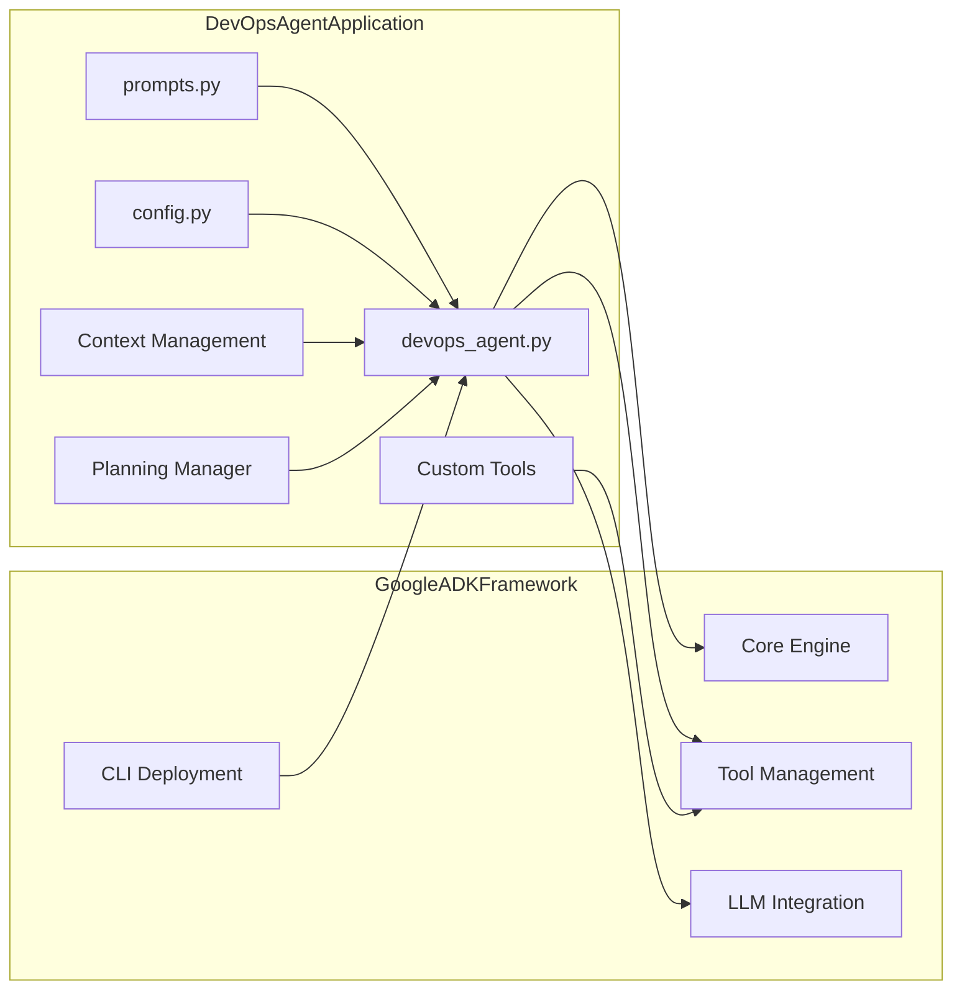
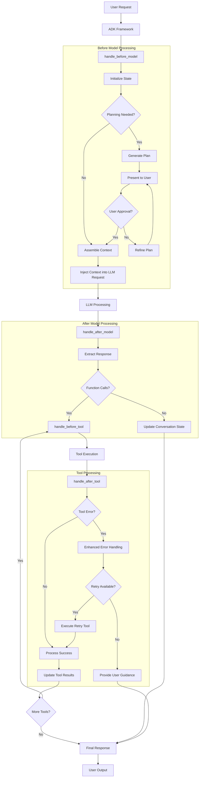
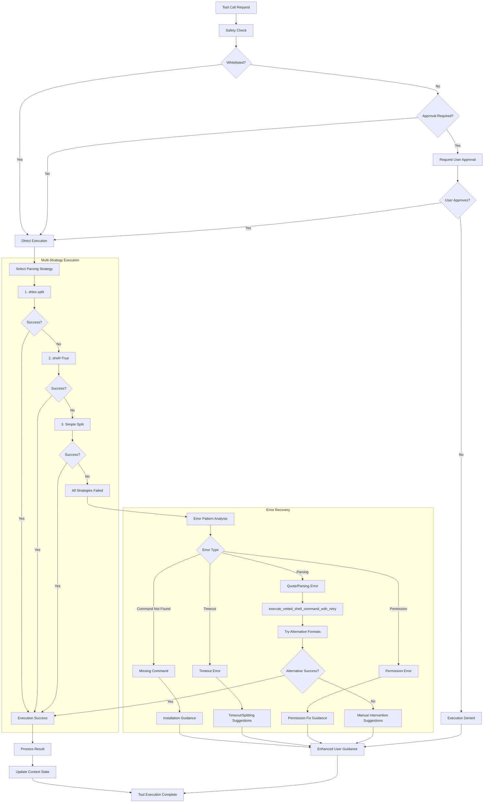
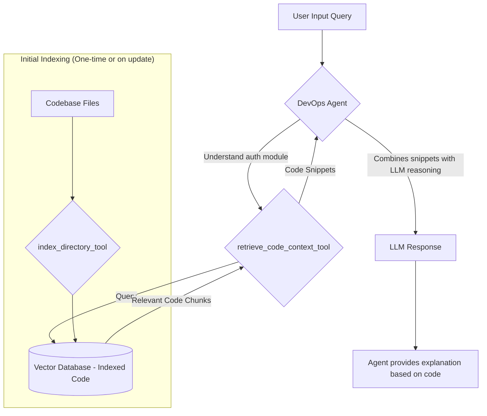
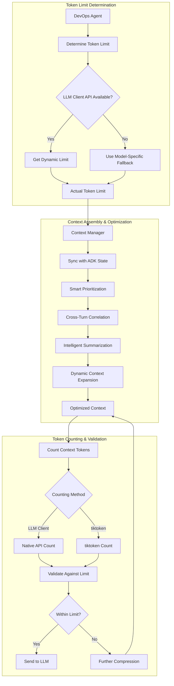

# Architecture Overview

The DevOps Agent implements a sophisticated multi-layered architecture that integrates with the Google ADK framework while providing advanced capabilities through custom components.

## Google ADK Framework Integration

## Agent Request Processing Lifecycle

The agent processes requests through a sophisticated callback-driven lifecycle that enables advanced planning, context management, and error handling:

## Enhanced Tool Execution System

Our robust tool execution system includes comprehensive error handling, automatic retry capabilities, and safety-first design:

## Codebase Understanding with RAG

A key feature of the DevOps agent is its ability to understand and interact with codebases through Retrieval-Augmented Generation:

### RAG Implementation Details

1. **`index_directory_tool`**: Scans directories, processes supported file types, breaks them into manageable chunks, generates vector embeddings, and stores them in ChromaDB
2. **`retrieve_code_context_tool`**: Takes natural language queries, converts them to embeddings, and searches the vector database for relevant code chunks
3. **Semantic Search**: Uses Google embeddings for high-quality semantic understanding of code structure and relationships

## Token Management Architecture

The agent implements sophisticated token counting and management for efficient LLM interactions:

## Key Architectural Benefits

### Performance Optimizations
- **244x improvement** in token utilization through smart context management
- **Dynamic context expansion** for relevant information discovery
- **Multi-strategy parsing** for robust command execution

### Safety & Reliability
- **Safety-first tool execution** with user approval workflows
- **Comprehensive error handling** with automatic retry capabilities
- **Multi-layered validation** for command parsing and execution

### Scalability
- **Serverless deployment** options with Google Cloud Run
- **Managed infrastructure** with Agent Engine
- **Container-native** design for flexible deployment

### Developer Experience
- **Multiple interface options** (CLI, TUI, Web, API)
- **Session management** for continuous workflows
- **Real-time monitoring** and token tracking
- **Rich debugging** and tracing capabilities 