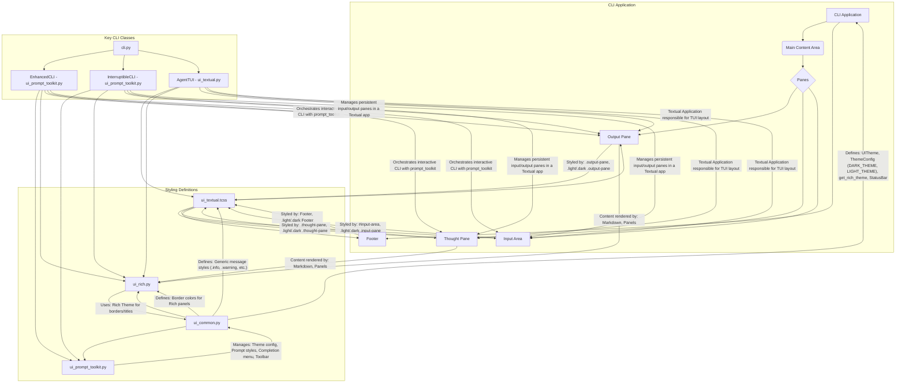

# UI Component Styling in ADK CLI

This document outlines where and how the various UI components of the ADK Command Line Interface are styled. The styling is distributed across several key files, utilizing Textual CSS, `prompt_toolkit` for interactive elements, and `rich` for rich content rendering.

## Styling Architecture Diagram

```mermaid
   info
```



## Key CLI Classes and their Role in UI Styling

The ADK CLI leverages several key Python classes to construct and manage its user interface, each playing a specific role in how components are styled and rendered.

*   **`EnhancedCLI`** (found in `src/wrapper/adk/cli/utils/ui_prompt_toolkit.py`): This class is responsible for setting up and managing the interactive prompt session using the `prompt_toolkit` library. It integrates the `ThemeConfig` from `ui_common.py` to apply dynamic styling based on the selected theme (light/dark). It also uses `RichRenderer` (from `ui_rich.py`) for formatting agent responses and other rich content within the standard prompt-based CLI.

*   **`InterruptibleCLI`** (also in `src/wrapper/adk/cli/utils/ui_prompt_toolkit.py`): This class extends `EnhancedCLI` to provide an interruptible CLI experience. It manages the layout of the UI components (input, output, and thought panes) within a `prompt_toolkit` application. While it doesn't directly handle the low-level styling of elements like borders or backgrounds (that's left to Textual CSS), it orchestrates their placement and ensures they use the correct `Rich` console for output.

*   **`AgentTUI`** (found in `src/wrapper/adk/cli/utils/ui_textual.py`): This class is a `Textual` application that defines the overall layout and behavior of the terminal user interface. It is responsible for composing the various panes (output, thought, input) and applying the CSS rules defined in `ui_textual.tcss`. `AgentTUI` utilizes the `Rich` library's `Console` and `Panel` components, often in conjunction with `RichRenderer`, to display formatted text, agent responses, and tool outputs within its panes. It leverages `ui_common.py` for theme-specific `Rich` styling.

## UI Component Styling Summary

| UI Component(s)         | Styling File(s)                                   | Description                                                                                                                                                                                                                                                                          |
|-------------------------|---------------------------------------------------|----------------------------------------------------------------------------------------------------------------------------------------------------------------------------------------------------------------------------------------------------------------------|
| **Overall Layout & Panes** | `src/wrapper/adk/cli/utils/ui_textual.tcss`       | Defines the visual appearance of the main UI elements using Textual CSS. This includes:<ul><li>`Screen`: overall background.</li><li>`.light` and `.dark` classes: define background and text colors for light and dark themes.</li><li>`.output-pane`, `.thought-pane`, `#input-area`: define dimensions, borders, margins, padding, background, and scroll behavior for these main display areas.</li><li>`Footer` and `#status-bar`: styles the bottom status bar(s). The `#status-bar` is primarily used for the main bottom toolbar which is populated by the `StatusBar` class in `ui_common.py`.</li><li>Generic message styles: `.info`, `.warning`, `.error`, `.success`, `.accent`, `.highlight`, `.user`, `.agent`, and `.welcome` for various types of text messages. These styles are used by `AgentTUI` for direct Textual rendering, and their counterparts in `ui_common.py` are used by `RichRenderer` for Rich content.</li></ul> |
| **Interactive CLI Elements** | `