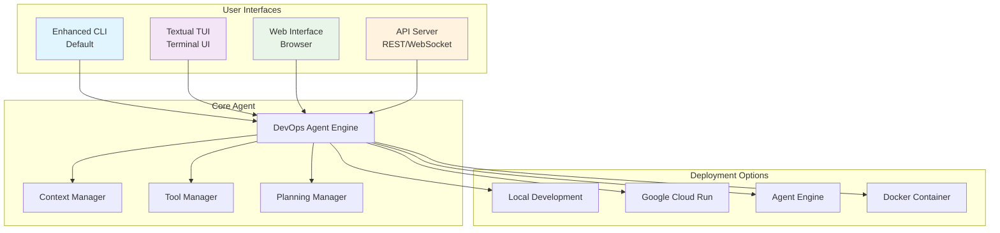
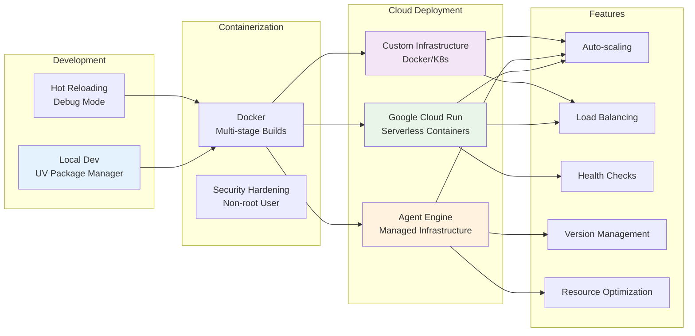
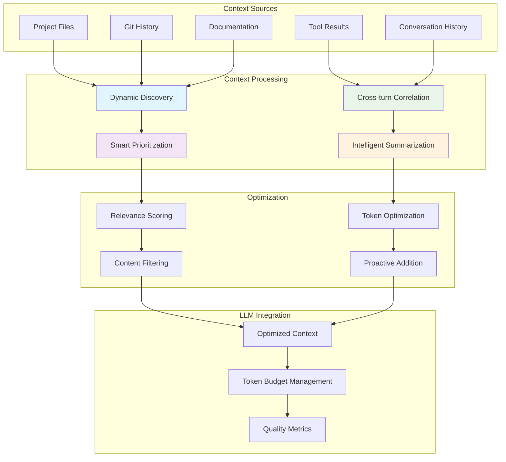

# Key Features

The DevOps Agent is equipped with a comprehensive suite of features to assist developers and DevOps engineers throughout the software development lifecycle.

## 🖥️ Advanced CLI Interfaces

### Enhanced CLI (Default)
Rich interactive command-line interface with professional-grade features:
- **Multi-line Input Support**: Use `Alt+Enter` for complex, multi-line requests
- **Mouse Interaction**: Click to position cursor, drag to select text, scroll through content
- **Smart Auto-completion**: `Tab` completion for 50+ DevOps commands with contextual suggestions
- **Command History**: Navigate with `↑/↓` keys, with intelligent auto-suggestions
- **Visual Enhancements**: Styled prompts, continuation indicators, contextual help
- **Theme Support**: Dynamic dark/light theme switching
- **Keyboard Shortcuts**: Comprehensive hotkey support for efficient workflows

### Textual TUI (Terminal User Interface)
Full-featured terminal user interface with persistent interaction capabilities:
- **Persistent Input Pane**: Type commands while agent is processing
- **Agent Interruption**: `Ctrl+C` to stop long-running operations instantly
- **Split-Pane Layout**: Dedicated output, thought, and input areas
- **Real-time Status**: Visual indicators for agent state and progress
- **Agent Thoughts Display**: Optional side pane showing agent's reasoning process
- **Session Management**: Save, resume, and replay interactive sessions
- **Categorized Commands**: Organized command completion by functional areas
- **Token Usage Tracking**: Real-time display of token consumption and model usage

### Web Interface
Modern browser-based interface for web-native interactions:
- **Responsive Design**: Works across desktop and mobile browsers
- **Session Persistence**: Maintain conversations across browser sessions
- **Artifact Management**: Upload, download, and manage files
- **CORS Support**: Configurable cross-origin resource sharing
- **Auto-reload**: Development mode with automatic server reloading

### API Server
RESTful API for programmatic access and integration:
- **OpenAPI Specification**: Fully documented API endpoints
- **Streaming Support**: Real-time response streaming via Server-Sent Events
- **Session Management**: Create, list, and manage user sessions
- **Artifact Storage**: Upload and retrieve files and artifacts
- **WebSocket Support**: Real-time bidirectional communication
- **Authentication**: Configurable authentication mechanisms

## 🚀 Deployment & Infrastructure

### Local Development
Streamlined local development experience:
- **UV Package Manager**: First-class support for modern Python packaging
- **Environment Detection**: Automatic project and dependency discovery
- **Hot Reloading**: Instant updates during development
- **Debug Mode**: Enhanced logging and tracing capabilities

### Google Cloud Run Deployment
One-command deployment to serverless containers:
- **Automated Dockerfile Generation**: Creates optimized container images
- **Environment Configuration**: Automatic environment variable setup
- **Service Scaling**: Configurable auto-scaling parameters
- **Load Balancing**: Built-in load balancing and traffic management
- **Health Checks**: Automatic health check configuration
- **Custom Domains**: Support for custom domain mapping

### Agent Engine Deployment
Deploy to Google Cloud's managed agent infrastructure:
- **Managed Infrastructure**: Fully managed agent hosting
- **Auto-scaling**: Automatic scaling based on demand
- **Integrated Monitoring**: Built-in monitoring and alerting
- **Version Management**: Blue-green deployments and rollback capabilities
- **Resource Optimization**: Automatic resource allocation and optimization

### Docker Containerization
Flexible containerized deployment options:
- **Multi-stage Builds**: Optimized container images
- **Security Hardening**: Non-root user configuration
- **Environment Flexibility**: Support for various deployment environments
- **Custom Base Images**: Configurable base image selection

## 🤖 AI & Machine Learning Capabilities

### Gemini Thinking Feature
Advanced reasoning capabilities with Gemini 2.5 series models:
- **Enhanced Problem Solving**: Internal reasoning for complex DevOps tasks
- **Supported Models**: `gemini-2.5-flash-preview-05-20`, `gemini-2.5-pro-preview-06-05`
- **Thinking Token Transparency**: Detailed breakdown of reasoning token usage
- **Configurable Thinking Budget**: Adjustable token allocation for reasoning
- **Thought Summaries**: Optional display of agent's thinking process

### RAG-Enhanced Codebase Understanding
Deep semantic search and retrieval using ChromaDB:
- **Vector Storage**: ChromaDB with Google embeddings for semantic search
- **Automatic Indexing**: Project files and documentation.
- **Contextual Retrieval**: Intelligent context gathering for relevant information
- **Code Analysis**: Deep understanding of code structure and relationships
- **Documentation Integration**: Seamless integration with project documentation

> **Note:** This feature requires configuration. See the [[Getting Started Guide|getting_started]] for a tutorial and the [[Configuration Reference|configuration]] for all available options.

### Token Optimization Callbacks
The Software Engineer Agent uses a sophisticated callback system to optimize token usage, reducing costs and improving response times.
- **Intelligent Filtering:** Reduces conversation history to the most relevant exchanges.
- **Context Pruning:** Removes unnecessary data from the context.
- **Summarization:** Condenses long text while preserving key information.

> For more details, see the [[Token Optimization Callbacks|usage/token-optimization-callbacks]] user guide.

## 🛠️ DevOps Automation

### CI/CD Automation
Comprehensive pipeline management and automation:
- **For Developers**: Accelerate development cycles with automated pipeline generation
- **For Platform Engineers**: Standardize and manage CI/CD pipelines across teams
- **Pipeline Templates**: Reusable, configurable pipeline templates
- **Build Troubleshooting**: Intelligent analysis of failing builds
- **Deployment Automation**: Automated deployment steps and rollback procedures

### Infrastructure Management
Simplify cloud and on-premise infrastructure operations:
- **Infrastructure as Code**: Generate Terraform, Ansible, and CloudFormation templates
- **Resource Optimization**: Cost analysis and optimization recommendations
- **Multi-cloud Support**: Support for AWS, GCP, Azure, and hybrid environments
- **Compliance Monitoring**: Automated compliance checks and reporting
- **Disaster Recovery**: Backup and recovery automation

### Workflow Automation
Reclaim time by automating routine and complex DevOps tasks:
- **Task Orchestration**: Complex multi-step workflow automation
- **Incident Response**: Automated incident detection and response
- **Compliance Automation**: Automated compliance checks and remediation
- **Resource Cleanup**: Automated cleanup of unused resources
- **Monitoring Setup**: Automated monitoring and alerting configuration

## 🧠 Advanced Context Management

### Intelligent Context Processing
Multi-factor relevance scoring and content discovery:
- **Dynamic Context Expansion**: Automatic discovery of relevant project context
- **Cross-turn Correlation**: Intelligent context preservation across conversations
- **Smart Prioritization**: Relevance-based context prioritization
- **Intelligent Summarization**: Automatic summarization of large contexts
- **Proactive Context Addition**: Zero-configuration context discovery

### Tool Integration & Discovery
Comprehensive tool ecosystem with safety-first approach:
- **Dynamic Tool Discovery**: Automatic discovery of available tools and capabilities
- **Safety Workflows**: User approval workflows for sensitive operations
- **Tool Categorization**: Organized tool discovery by functional areas
- **Integration Patterns**: Standardized integration with external tools
- **Custom Tool Support**: Framework for adding custom tools and integrations

## 📊 Observability & Monitoring

### Token Optimization & Transparency
Comprehensive token usage tracking and optimization:
- **Usage Transparency**: Detailed breakdowns of token consumption
- **Dynamic Limits**: Automatic token limit determination
- **Optimization Strategies**: Context optimization to maximize relevance
- **Cost Tracking**: Real-time cost estimation and tracking
- **Performance Metrics**: Detailed performance and efficiency metrics

### Comprehensive Logging & Tracing
Production-ready observability features:
- **Structured Logging**: JSON-structured logs for easy analysis
- **Distributed Tracing**: Full request tracing across components
- **Cloud Integration**: Native integration with Google Cloud Logging and Tracing
- **Error Tracking**: Comprehensive error tracking and reporting
- **Performance Monitoring**: Real-time performance monitoring and alerting

## 🎯 Interactive Planning & Collaboration

### Collaborative Task Planning
Tackle complex tasks with confidence through interactive planning:
- **Plan Generation**: AI-generated plans for complex tasks
- **Review Workflows**: Interactive plan review and approval
- **Step-by-step Execution**: Guided execution with progress tracking
- **Modification Support**: Real-time plan modification and adaptation
- **Rollback Capabilities**: Safe rollback of partially executed plans

> **Note:** This feature is disabled by default. To learn how to enable and use it, see the `ENABLE_INTERACTIVE_PLANNING` flag in the [[Configuration Reference|configuration]]. A detailed usage guide is forthcoming.

### Session Management
Comprehensive session handling for continuous workflows:
- **Session Persistence**: Save and resume long-running sessions
- **Session Replay**: Replay previous sessions for debugging or training
- **Multi-user Support**: Concurrent multi-user session management
- **Session Analytics**: Detailed analytics on session usage and patterns
- **Export Capabilities**: Export sessions for documentation or sharing

## 🔧 Development & Integration

### Project Creation & Scaffolding
Streamlined project creation with intelligent defaults:
- **Interactive Creation**: Guided project creation with best practices
- **Template Library**: Extensive library of project templates
- **Dependency Management**: Automatic dependency resolution and management
- **Configuration Generation**: Automatic generation of configuration files
- **Documentation Generation**: Automatic README and documentation creation

### Integration Ecosystem
Extensive integration capabilities for existing workflows:
- **Version Control**: Deep integration with Git and other VCS systems
- **Package Managers**: Support for pip, uv, npm, yarn, and other package managers
- **Build Systems**: Integration with Maven, Gradle, Make, and other build tools
- **Cloud Platforms**: Native integration with major cloud providers
- **Monitoring Tools**: Integration with Prometheus, Grafana, and other monitoring solutions

## 🔒 Security & Compliance

### Security-First Design
Built-in security features for enterprise environments:
- **Secure by Default**: Security-first configuration and defaults
- **Access Control**: Fine-grained access control and permissions
- **Audit Logging**: Comprehensive audit trails for compliance
- **Secret Management**: Secure handling of sensitive information
- **Vulnerability Scanning**: Automated security vulnerability detection

### Enterprise Features
Production-ready features for enterprise deployment:
- **High Availability**: Multi-region deployment support
- **Disaster Recovery**: Automated backup and recovery procedures
- **Scalability**: Horizontal and vertical scaling capabilities
- **Monitoring Integration**: Enterprise monitoring and alerting integration
- **Compliance Reporting**: Automated compliance reporting and documentation

---

The DevOps Agent represents a comprehensive solution for modern DevOps workflows, combining cutting-edge AI capabilities with robust engineering practices to deliver a powerful, flexible, and user-friendly experience across all interaction modes.
