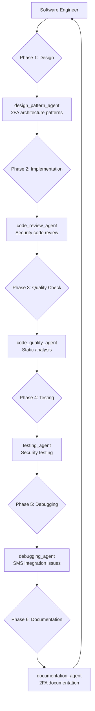
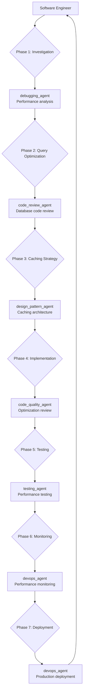
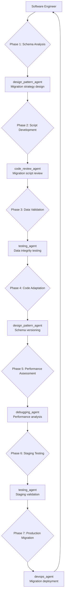
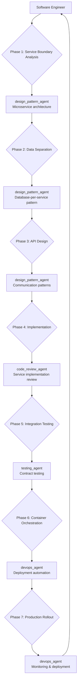
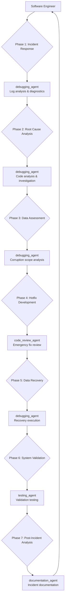

# Software Engineering Scenarios: Real-World Development Workflows

```mermaid
graph TD
    SE[Software Engineer] --> DA(design_pattern_agent)
    SE --> CR(code_review_agent)
    SE --> CQ(code_quality_agent)
    SE --> TA(testing_agent)
    SE --> DB(debugging_agent)
    SE --> DO(documentation_agent)
    SE --> DV(devops_agent)

    DA --> SE
    CR --> SE
    CQ --> SE
    TA --> SE
    DB --> SE
    DO --> SE
    DV --> SE

    subgraph Agent Tools
        DA -- uses --> LDC[list_directory_contents]
        DA -- uses --> RFC[read_file_content]
        DA -- uses --> RGS[ripgrep_code_search]
        DA -- uses --> GSG[google_search_grounding]
        DA -- might suggest --> EFC[edit_file_content]

        CR -- uses --> RFC
        CR -- uses --> AC[analyze_code]
        CR -- uses --> RGS
        CR -- uses --> GSG
        CR -- suggests --> EFC

        CQ -- uses --> AC
        CQ -- uses --> GIS[get_issues_by_severity]
        CQ -- uses --> RFC
        CQ -- uses --> SF[suggest_fixes]
        CQ -- suggests --> EFC

        TA -- uses --> RFC
        TA -- uses --> LDC
        TA -- uses --> WF[write_file]
        TA -- uses --> ESC[execute_shell_command]
        TA -- uses --> GSG

        DB -- uses --> RFC
        DB -- uses --> ESC
        DB -- uses --> RGS
        DB -- uses --> GSG
        DB -- suggests --> EFC

        DO -- uses --> RFC
        DO -- uses --> EFC
        DO -- uses --> WF
        DO -- uses --> GSG

        DV -- uses --> RFC
        DV -- uses --> EFC
        DV -- uses --> ESC
        DV -- uses --> GSG
    end
```

These scenarios illustrate how a software engineer orchestrates complex tasks, delegating to specialized AI agents and utilizing various tools at each stage of development.

---

## Scenario 1: Implementing Two-Factor Authentication

A software engineer is tasked with enhancing the security of an existing web application by adding a Two-Factor Authentication (2FA) mechanism using SMS verification.

### 1. Initial Understanding & Design Phase

*   **Software Engineer's Action:** The engineer begins by understanding the requirements, identifying existing authentication flows, and considering how 2FA will integrate without disrupting current user experiences. They think about the database schema changes, API endpoints, and front-end interactions.
*   **Agent Involvement:**
    *   **`design_pattern_agent`:** The engineer delegates to the `design_pattern_agent` to recommend the best architectural approach for integrating 2FA.
        *   **Tools Used:**
            *   `list_directory_contents`: To get an overview of the project structure.
            *   `read_file_content`: To understand existing authentication logic, user models, and configuration.
            *   `ripgrep_code_search`: To quickly locate all authentication-related code.
            *   `google_search_grounding`: To research industry best practices and common architectural solutions for 2FA.
        *   **Output:** The agent would provide recommendations on patterns like "Strategy Pattern" for different 2FA methods, "Decorator Pattern" for augmenting existing authentication, and advice on secure token handling, possibly proposing a high-level `edit_file_content` for a new design document.

### 2. Core Development & Implementation Phase

*   **Software Engineer's Action:** Based on the design, the engineer starts writing the code for generating and sending SMS codes, verifying user input, updating user profiles with 2FA status, and modifying login flows.
*   **Agent Involvement:**
    *   **(Primarily Software Engineer):** The engineer is actively coding here.
    *   **`code_review_agent`:** As the code is being written, or once a significant chunk is complete, the engineer sends it to the `code_review_agent`.
        *   **Tools Used:**
            *   `read_file_content`: To read the newly implemented 2FA code and security configurations.
            *   `analyze_code`: To perform static analysis specifically looking for security vulnerabilities (e.g., insecure random number generation, improper input validation) or performance bottlenecks.
            *   `ripgrep_code_search`: To ensure no secrets are hardcoded.
            *   `google_search_grounding`: To cross-reference known security risks.
        *   **Output:** The agent would identify potential security flaws, suggest performance optimizations, and recommend improvements for code correctness, often using `default_api.edit_file_content` to propose direct code changes.

### 3. Quality Assurance & Static Analysis Phase

*   **Software Engineer's Action:** Before committing the code, the engineer wants to ensure it adheres to coding standards and doesn't introduce technical debt.
*   **Agent Involvement:**
    *   **`code_quality_agent`:** The engineer delegates to the `code_quality_agent`.
        *   **Tools Used:**
            *   `analyze_code`: To run comprehensive static analysis for code smells, complexity, and style violations.
            *   `get_issues_by_severity`: To retrieve all quality warnings and informationals.
            *   `read_file_content`: To understand project dependencies and build configurations that might affect quality tools.
            *   `suggest_fixes`: To get automated suggestions for common quality issues like unused imports or redundant code.
        *   **Output:** The agent would provide a list of code quality issues (e.g., high cyclomatic complexity, missing Javadoc, non-compliant formatting) and propose fixes, often using `default_api.edit_file_content` to auto-format or refactor.

### 4. Testing Phase

*   **Software Engineer's Action:** The engineer needs to verify that the 2FA functionality works correctly, handles edge cases, and doesn't break existing features.
*   **Agent Involvement:**
    *   **`testing_agent`:** The engineer delegates to the `testing_agent`.
        *   **Tools Used:**
            *   `read_file_content`: To understand the methods that need testing.
            *   `list_directory_contents`: To identify where existing tests are located.
            *   `write_file`: To create new unit test files with comprehensive test cases for code generation, expiry, and verification.
            *   `execute_shell_command`: To run the newly created tests and report results.
            *   `google_search_grounding`: To ensure test coverage includes security considerations.
        *   **Output:** The agent would provide a test strategy, create new test files, execute them, and report on test coverage and failures.

### 5. Debugging & Issue Resolution Phase

*   **Software Engineer's Action:** During testing (or even after a small deployment to a staging environment), an issue arises: "Users are intermittently not receiving SMS codes."
*   **Agent Involvement:**
    *   **`debugging_agent`:** The engineer delegates to the `debugging_agent`.
        *   **Tools Used:**
            *   `read_file_content`: To analyze application and system logs for errors related to SMS sending or network issues.
            *   `execute_shell_command`: To directly test the SMS gateway API from the server environment.
            *   `ripgrep_code_search`: To quickly find relevant error handling blocks in the code.
            *   `google_search_grounding`: To research specific error messages from the SMS provider.
            *   `edit_file_content`: To propose and apply a fix (e.g., adding retry logic or better error logging).
        *   **Output:** The agent would diagnose the root cause (e.g., rate limiting from the SMS provider, network configuration issues, or a bug in error handling) and propose a precise code fix or configuration change.

### 6. Documentation Phase

*   **Software Engineer's Action:** Once the 2FA feature is stable, thoroughly tested, and bugs are resolved, it needs to be documented.
*   **Agent Involvement:**
    *   **`documentation_agent`:** The engineer delegates to the `documentation_agent`.
        *   **Tools Used:**
            *   `read_file_content`: To read method signatures and existing inline comments for generating API documentation.
            *   `edit_file_content`: To add missing Javadoc/docstrings to classes and methods.
            *   `write_file`: To create a new developer-focused integration guide for 2FA.
            *   `edit_file_content`: To update the project's main README with instructions for enabling and testing 2FA.
            *   `google_search_grounding`: To ensure high-quality documentation.
        *   **Output:** The agent would update code comments, generate API documentation, and create user/developer guides, presenting the proposed changes as `edit_file_content` or `write_file` operations.

### 7. Deployment & Operational Considerations Phase

*   **Software Engineer's Action:** The feature is ready for production deployment, and the engineer needs to ensure it's deployed smoothly and operates reliably.
*   **Agent Involvement:**
    *   **`devops_agent`:** The engineer delegates to the `devops_agent`.
        *   **Tools Used:**
            *   `read_file_content`: To review the existing CI/CD pipeline configuration.
            *   `edit_file_content`: To propose adding new stages for security scanning or specific 2FA integration tests in the pipeline.
            *   `read_file_content`: To understand current deployment manifests.
            *   `edit_file_content`: To suggest updates for environment variables (e.g., for SMS API keys via Kubernetes secrets).
            *   `execute_shell_command`: To check the status of existing authentication service pods.
            *   `google_search_grounding`: To research best practices for setting up observability.
        *   **Output:** The agent would provide actionable recommendations for CI/CD pipeline modifications, secret management, scaling considerations, and monitoring strategies, often by proposing direct changes to configuration files using `edit_file_content`.

---

## Scenario 2: API Performance Optimization

A software engineer receives reports that the product catalog API is experiencing severe performance degradation, with response times exceeding 5 seconds for basic product searches. User complaints are mounting, and the issue needs immediate investigation and resolution.

### 1. Performance Analysis & Investigation Phase

*   **Software Engineer's Action:** The engineer begins by gathering performance metrics, analyzing current system behavior, and identifying bottlenecks in the API response pipeline.
*   **Agent Involvement:**
    *   **`debugging_agent`:** The engineer delegates to the `debugging_agent` to diagnose the root cause of the performance issues.
        *   **Tools Used:**
            *   `read_file_content`: To analyze recent performance logs and request patterns.
            *   `execute_shell_command`: To measure actual response times and identify slow endpoints.
            *   `ripgrep_code_search`: To locate database queries that might be causing performance issues.
            *   `google_search_grounding`: To research best practices for optimizing product search queries.
        *   **Output:** The agent would identify specific slow queries, missing database indexes, inefficient joins, or connection pool issues, providing detailed performance metrics and initial optimization recommendations.

### 2. Database Query Optimization Phase

*   **Software Engineer's Action:** Based on the investigation, the engineer focuses on optimizing database queries, particularly those involving product searches and complex joins.
*   **Agent Involvement:**
    *   **`code_review_agent`:** The engineer delegates to the `code_review_agent` to review and optimize the database interaction code.
        *   **Tools Used:**
            *   `read_file_content`: To examine existing query implementations and identify inefficiencies.
            *   `analyze_code`: To perform static analysis on service layer code for performance anti-patterns.
            *   `execute_shell_command`: To analyze query execution plans and identify missing indexes.
            *   `google_search_grounding`: To research advanced search optimization strategies.
        *   **Output:** The agent would propose optimized queries, suggest database indexes, recommend query restructuring, and provide `edit_file_content` changes to implement pagination and result limiting.

### 3. Caching Strategy Implementation Phase

*   **Software Engineer's Action:** The engineer decides to implement a caching layer to reduce database load for frequently accessed product data.
*   **Agent Involvement:**
    *   **`design_pattern_agent`:** The engineer delegates to the `design_pattern_agent` to recommend the best caching architecture.
        *   **Tools Used:**
            *   `read_file_content`: To understand current configuration and identify where caching can be integrated.
            *   `list_directory_contents`: To examine existing configuration patterns.
            *   `ripgrep_code_search`: To identify any existing caching implementations.
            *   `google_search_grounding`: To research optimal caching patterns for product data.
        *   **Output:** The agent would recommend cache-aside or write-through patterns, suggest appropriate cache keys and TTL values, and propose `edit_file_content` changes to implement Redis caching with Spring Boot's caching annotations.

### 4. Code Implementation & Integration Phase

*   **Software Engineer's Action:** The engineer implements the proposed optimizations, including database query improvements, caching layer, and connection pool tuning.
*   **Agent Involvement:**
    *   **`code_quality_agent`:** The engineer delegates to the `code_quality_agent` to ensure the optimization code meets quality standards.
        *   **Tools Used:**
            *   `analyze_code`: To validate that the optimized code maintains readability and follows best practices.
            *   `get_issues_by_severity`: To identify any potential issues introduced by the performance optimizations.
            *   `read_file_content`: To review the new caching configuration for correctness.
            *   `suggest_fixes`: To get recommendations for improving code structure and eliminating any technical debt.
        *   **Output:** The agent would ensure proper error handling for cache failures, validate configuration parameters, and suggest improvements to maintain code quality while achieving performance gains.

### 5. Performance Testing & Validation Phase

*   **Software Engineer's Action:** The engineer needs to validate that the optimizations actually improve performance and don't introduce regressions.
*   **Agent Involvement:**
    *   **`testing_agent`:** The engineer delegates to the `testing_agent` to create comprehensive performance tests.
        *   **Tools Used:**
            *   `write_file`: To create performance test suites that measure response times and throughput.
            *   `execute_shell_command`: To run load testing against the optimized endpoints.
            *   `read_file_content`: To create or examine test data for consistent performance testing.
            *   `google_search_grounding`: To research comprehensive performance testing strategies.
        *   **Output:** The agent would create automated performance tests, establish performance baselines, and provide detailed reports comparing before/after metrics, ensuring the optimizations meet the performance requirements.

### 6. Monitoring & Observability Enhancement Phase

*   **Software Engineer's Action:** The engineer wants to implement better monitoring to prevent future performance issues and track the effectiveness of the optimizations.
*   **Agent Involvement:**
    *   **`devops_agent`:** The engineer delegates to the `devops_agent` to set up comprehensive performance monitoring.
        *   **Tools Used:**
            *   `read_file_content`: To understand the current infrastructure setup and identify where monitoring can be integrated.
            *   `edit_file_content`: To add custom metrics for tracking API performance and cache hit rates.
            *   `execute_shell_command`: To set up monitoring infrastructure.
            *   `google_search_grounding`: To research effective monitoring dashboard configurations.
        *   **Output:** The agent would configure Prometheus metrics collection, create Grafana dashboards for API performance visualization, set up alerting for performance thresholds, and provide infrastructure changes through `edit_file_content`.

### 7. Production Deployment & Rollback Strategy Phase

*   **Software Engineer's Action:** The engineer prepares for a careful production deployment with rollback capabilities in case the optimizations cause unexpected issues.
*   **Agent Involvement:**
    *   **`devops_agent`:** The engineer delegates to the `devops_agent` to plan the deployment strategy.
        *   **Tools Used:**
            *   `read_file_content`: To review the current deployment pipeline and plan optimization deployment.
            *   `edit_file_content`: To implement blue-green deployment configuration for safe rollouts.
            *   `execute_shell_command`: To examine current production deployment configuration.
            *   `google_search_grounding`: To research safe deployment strategies for performance-critical changes.
        *   **Output:** The agent would provide a detailed deployment plan with staged rollout, health checks, performance monitoring triggers, and automated rollback procedures, ensuring the optimizations can be safely deployed to production.

---

## Scenario 3: Database Schema Migration

A software engineer needs to implement a complex database schema migration to support a new customer relationship management (CRM) feature that requires adding new tables, modifying existing relationships, and migrating historical data without causing downtime.

### 1. Schema Analysis & Migration Planning Phase

*   **Software Engineer's Action:** The engineer begins by analyzing the current database schema, understanding data relationships, and planning the migration strategy to minimize risk and downtime.
*   **Agent Involvement:**
    *   **`design_pattern_agent`:** The engineer delegates to the `design_pattern_agent` to recommend the best approach for the schema migration.
        *   **Tools Used:**
            *   `read_file_content`: To understand the current database structure and existing migration patterns.
            *   `list_directory_contents`: To examine all existing database migrations and identify potential conflicts.
            *   `ripgrep_code_search`: To locate all JPA entities that might be affected by the schema changes.
            *   `google_search_grounding`: To research best practices for safe database migrations in production environments.
        *   **Output:** The agent would recommend a phased migration approach, suggest using techniques like shadow tables or feature flags, and propose a migration script structure that allows for safe rollbacks and minimal downtime.

### 2. Migration Script Development Phase

*   **Software Engineer's Action:** Based on the planning phase, the engineer writes the actual migration scripts, including data transformation logic and rollback procedures.
*   **Agent Involvement:**
    *   **`code_review_agent`:** The engineer delegates to the `code_review_agent` to review the migration scripts for potential issues.
        *   **Tools Used:**
            *   `read_file_content`: To examine the new migration script for syntax errors and logical issues.
            *   `analyze_code`: To review any custom data migration logic for performance and correctness.
            *   `execute_shell_command`: To validate migration script syntax and order.
            *   `google_search_grounding`: To research the performance implications of schema changes on large datasets.
        *   **Output:** The agent would identify potential issues like missing indexes, inefficient data transformations, or unsafe schema changes, and suggest improvements through `edit_file_content` to optimize migration performance and safety.

### 3. Data Integrity & Validation Phase

*   **Software Engineer's Action:** The engineer needs to ensure that the migration will preserve data integrity and that all existing data will be correctly transformed to the new schema.
*   **Agent Involvement:**
    *   **`testing_agent`:** The engineer delegates to the `testing_agent` to create comprehensive data validation tests.
        *   **Tools Used:**
            *   `write_file`: To create test suites that validate data integrity before and after migration.
            *   `execute_shell_command`: To create schema backups for testing and rollback purposes.
            *   `read_file_content`: To examine test data that represents edge cases and complex scenarios.
            *   `google_search_grounding`: To research comprehensive testing approaches for database migrations.
        *   **Output:** The agent would create automated tests to verify data consistency, row counts, foreign key relationships, and business logic constraints, ensuring the migration doesn't introduce data corruption or loss.

### 4. Application Code Adaptation Phase

*   **Software Engineer's Action:** The engineer updates the application code to work with both the old and new schema during the transition period, implementing backward compatibility.
*   **Agent Involvement:**
    *   **`design_pattern_agent`:** The engineer delegates to the `design_pattern_agent` to recommend patterns for handling schema versioning.
        *   **Tools Used:**
            *   `read_file_content`: To understand current entity models that need modification.
            *   `ripgrep_code_search`: To locate all database column references that might need updating.
            *   `list_directory_contents`: To identify repository classes that need modification for the new schema.
            *   `google_search_grounding`: To research strategies for maintaining application compatibility during database transitions.
        *   **Output:** The agent would recommend using the Adapter or Bridge patterns to abstract schema differences, suggest feature flags for gradual rollout, and propose `edit_file_content` changes to implement schema-agnostic data access layers.

### 5. Performance Impact Assessment Phase

*   **Software Engineer's Action:** The engineer needs to assess and mitigate any performance impact that the migration might have on the production system.
*   **Agent Involvement:**
    *   **`debugging_agent`:** The engineer delegates to the `debugging_agent` to analyze potential performance bottlenecks.
        *   **Tools Used:**
            *   `execute_shell_command`: To analyze query performance with the new schema structure.
            *   `read_file_content`: To examine current slow queries that might be affected by the migration.
            *   `ripgrep_code_search`: To locate native SQL queries that might need updating for the new schema.
            *   `google_search_grounding`: To research monitoring strategies during large-scale migrations.
        *   **Output:** The agent would identify queries that might become slower, suggest index optimizations, recommend query restructuring, and provide monitoring recommendations to track performance during the migration process.

### 6. Staging Environment Testing Phase

*   **Software Engineer's Action:** The engineer performs comprehensive testing in a staging environment that mirrors production data and load patterns.
*   **Agent Involvement:**
    *   **`testing_agent`:** The engineer delegates to the `testing_agent` to orchestrate comprehensive staging tests.
        *   **Tools Used:**
            *   `execute_shell_command`: To spin up the staging environment with the new schema.
            *   `write_file`: To create load testing scripts that simulate production traffic during migration.
            *   `read_file_content`: To examine integration tests that validate end-to-end functionality.
            *   `google_search_grounding`: To research comprehensive testing strategies for migration validation.
        *   **Output:** The agent would execute migration tests, validate application functionality, perform rollback tests, and provide detailed reports on migration success rates, timing, and any issues discovered during staging validation.

### 7. Production Deployment & Monitoring Phase

*   **Software Engineer's Action:** The engineer executes the carefully planned production migration with real-time monitoring and immediate rollback capabilities.
*   **Agent Involvement:**
    *   **`devops_agent`:** The engineer delegates to the `devops_agent` to manage the production migration deployment.
        *   **Tools Used:**
            *   `read_file_content`: To review the detailed migration execution plan and rollback procedures.
            *   `execute_shell_command`: To execute the migration as a Kubernetes job with proper resource allocation.
            *   `edit_file_content`: To configure real-time alerts for migration progress and potential issues.
            *   `google_search_grounding`: To research real-time monitoring strategies for production migrations.
        *   **Output:** The agent would provide a detailed execution plan with checkpoints, configure comprehensive monitoring dashboards, implement automated rollback triggers, and establish communication protocols for the migration team during the production deployment.

---

## Scenario 4: Microservice Implementation

A software engineer is tasked with extracting the notification functionality from a monolithic application and implementing it as a separate microservice to improve scalability, maintainability, and enable independent deployments.

### 1. Service Boundary Analysis & Design Phase

*   **Software Engineer's Action:** The engineer begins by analyzing the existing notification code within the monolith, identifying dependencies, and designing the boundaries for the new notification microservice.
*   **Agent Involvement:**
    *   **`design_pattern_agent`:** The engineer delegates to the `design_pattern_agent` to recommend the best microservice architecture patterns.
        *   **Tools Used:**
            *   `ripgrep_code_search`: To locate all notification-related code scattered throughout the monolith.
            *   `read_file_content`: To understand the current notification implementation and its dependencies.
            *   `list_directory_contents`: To get an overview of the monolith structure and identify tight coupling.
            *   `google_search_grounding`: To research best practices for extracting services from monoliths.
        *   **Output:** The agent would recommend domain-driven design patterns, suggest API contract definitions, propose event-driven communication patterns, and provide a high-level architecture design with clear service boundaries and integration points.

### 2. Data Separation & Schema Design Phase

*   **Software Engineer's Action:** The engineer needs to separate notification-related data from the monolith's database and design an independent schema for the notification service.
*   **Agent Involvement:**
    *   **`design_pattern_agent`:** The engineer delegates to the `design_pattern_agent` to recommend data management patterns for the microservice.
        *   **Tools Used:**
            *   `read_file_content`: To identify notification-related tables and data dependencies in the current monolith.
            *   `ripgrep_code_search`: To locate JPA entities related to notifications.
            *   `analyze_code`: To understand current data access patterns and relationships.
            *   `google_search_grounding`: To research strategies for database separation and data synchronization.
        *   **Output:** The agent would recommend the Database-per-Service pattern, suggest data migration strategies, propose event sourcing for data consistency, and provide schema design recommendations for the independent notification service database.

### 3. API Design & Communication Patterns Phase

*   **Software Engineer's Action:** The engineer designs the REST API for the notification service and establishes communication patterns between the monolith and the new microservice.
*   **Agent Involvement:**
    *   **`design_pattern_agent`:** The engineer delegates to the `design_pattern_agent` to recommend API design and inter-service communication patterns.
        *   **Tools Used:**
            *   `write_file`: To create OpenAPI specification for the notification service endpoints.
            *   `read_file_content`: To understand current notification endpoints that need to be moved.
            *   `list_directory_contents`: To identify data transfer objects used in notification operations.
            *   `google_search_grounding`: To research API design best practices and messaging patterns.
        *   **Output:** The agent would provide RESTful API designs with proper versioning, recommend asynchronous messaging using message queues, suggest circuit breaker patterns for resilience, and propose API contract testing strategies.

### 4. Microservice Implementation Phase

*   **Software Engineer's Action:** The engineer implements the notification microservice, including the business logic, data access layer, and integration with external notification providers.
*   **Agent Involvement:**
    *   **`code_review_agent`:** The engineer delegates to the `code_review_agent` to review the microservice implementation.
        *   **Tools Used:**
            *   `read_file_content`: To review the main application class and Spring Boot configuration.
            *   `analyze_code`: To perform static analysis on the notification service implementation.
            *   `ripgrep_code_search`: To review asynchronous processing and event handling implementation.
            *   `google_search_grounding`: To research microservice implementation best practices.
        *   **Output:** The agent would review error handling strategies, validate configuration management, ensure proper logging and monitoring integration, and suggest improvements for resilience and performance through `edit_file_content`.

### 5. Integration & Message Queue Setup Phase

*   **Software Engineer's Action:** The engineer sets up message queues for asynchronous communication between the monolith and the notification service, ensuring reliable message delivery.
*   **Agent Involvement:**
    *   **`devops_agent`:** The engineer delegates to the `devops_agent` to set up the messaging infrastructure and deployment pipeline.
        *   **Tools Used:**
            *   `write_file`: To set up RabbitMQ or Apache Kafka for message queuing.
            *   `read_file_content`: To configure message queue connections and retry policies.
            *   `execute_shell_command`: To start the messaging infrastructure.
            *   `google_search_grounding`: To research reliable messaging patterns and error handling.
        *   **Output:** The agent would configure message queues with proper routing, implement dead letter queues for failed messages, set up monitoring for queue health, and provide infrastructure configuration through `edit_file_content`.

### 6. Testing & Service Contract Validation Phase

*   **Software Engineer's Action:** The engineer creates comprehensive tests for the notification service, including unit tests, integration tests, and contract tests to ensure reliable communication with the monolith.
*   **Agent Involvement:**
    *   **`testing_agent`:** The engineer delegates to the `testing_agent` to create a comprehensive testing strategy.
        *   **Tools Used:**
            *   `write_file`: To create unit tests for the notification service business logic.
            *   `execute_shell_command`: To run the test suite and validate service functionality.
            *   `read_file_content`: To create consumer-driven contract tests using Pact or Spring Cloud Contract.
            *   `google_search_grounding`: To research microservice testing strategies contract testing Spring Boot.
        *   **Output:** The agent would create unit tests, integration tests with embedded message queues, contract tests for API compatibility, and end-to-end tests that validate the complete notification flow from monolith to service.

### 7. Deployment & Monitoring Setup Phase

*   **Software Engineer's Action:** The engineer deploys the notification service to production with proper monitoring, logging, and observability to ensure it operates reliably in the distributed system.
*   **Agent Involvement:**
    *   **`devops_agent`:** The engineer delegates to the `devops_agent` to set up production deployment and monitoring.
        *   **Tools Used:**
            *   `write_file`: To create optimized Docker images for the notification service.
            *   `edit_file_content`: To configure Kubernetes deployment with proper resource limits and health checks.
            *   `execute_shell_command`: To deploy the service to the Kubernetes cluster.
            *   `google_search_grounding`: To research monitoring and observability best practices for microservices.
        *   **Output:** The agent would configure comprehensive monitoring with metrics collection, implement distributed tracing for request correlation, set up logging aggregation, create alerting rules for service health, and provide deployment automation through CI/CD pipeline integration.

---

## Scenario 5: Critical Bug Investigation

A software engineer receives an urgent alert that the production e-commerce system is experiencing data corruption where customer orders are being assigned to wrong users, causing privacy violations and incorrect billing. The bug needs immediate investigation and resolution.

### 1. Incident Response & Initial Triage Phase

*   **Software Engineer's Action:** The engineer immediately begins damage assessment, identifies the scope of the data corruption, and implements temporary measures to prevent further data integrity issues.
*   **Agent Involvement:**
    *   **`debugging_agent`:** The engineer delegates to the `debugging_agent` to rapidly diagnose the extent and cause of the data corruption.
        *   **Tools Used:**
            *   `read_file_content`: To analyze recent error logs for patterns and anomalies around the time corruption started.
            *   `execute_shell_command`: To examine recent order creation requests for unusual patterns.
            *   `ripgrep_code_search`: To quickly locate all code that handles user/customer identification in order processing.
            *   `google_search_grounding`: To research systematic approaches for investigating data integrity issues.
        *   **Output:** The agent would identify the timeframe when corruption began, estimate the number of affected records, pinpoint suspicious code paths, and recommend immediate containment measures like disabling order processing or implementing additional validation.

### 2. Root Cause Analysis Phase

*   **Software Engineer's Action:** The engineer performs deep analysis to identify the exact cause of the data corruption, examining recent code changes, database transactions, and system behavior.
*   **Agent Involvement:**
    *   **`debugging_agent`:** The engineer delegates to the `debugging_agent` to perform comprehensive root cause analysis.
        *   **Tools Used:**
            *   `execute_shell_command`: To examine recent commits to order-related code that might have introduced the bug.
            *   `read_file_content`: To analyze the order creation logic for race conditions or logic errors.
            *   `analyze_code`: To examine user context handling that might be causing user ID mixups.
            *   `google_search_grounding`: To research common causes of user ID corruption in web applications.
        *   **Output:** The agent would identify the specific code defect (e.g., shared mutable state, race condition in user session handling, or incorrect transaction boundaries), provide detailed analysis of the bug mechanism, and recommend the exact fix needed.

### 3. Data Assessment & Recovery Planning Phase

*   **Software Engineer's Action:** The engineer needs to assess the extent of corrupted data and plan a strategy for data recovery and correction without affecting unrelated records.
*   **Agent Involvement:**
    *   **`debugging_agent`:** The engineer delegates to the `debugging_agent` to develop data assessment and recovery strategies.
        *   **Tools Used:**
            *   `execute_shell_command`: To quantify the scope of data corruption.
            *   `write_file`: To create comprehensive data validation queries that identify all affected records.
            *   `read_file_content`: To examine recent database backups for recovery reference data.
            *   `google_search_grounding`: To research safe data recovery techniques for production databases.
        *   **Output:** The agent would provide detailed data corruption analysis, create scripts to identify all affected records, develop safe data recovery procedures, and recommend validation steps to ensure recovery accuracy.

### 4. Hotfix Development & Testing Phase

*   **Software Engineer's Action:** The engineer develops a critical hotfix to stop the data corruption and prepares it for emergency deployment to production.
*   **Agent Involvement:**
    *   **`code_review_agent`:** The engineer delegates to the `code_review_agent` to ensure the hotfix is correct and doesn't introduce new issues.
        *   **Tools Used:**
            *   `read_file_content`: To review the proposed fix for the order service user context handling.
            *   `analyze_code`: To perform static analysis on the emergency fix to ensure it addresses the root cause without side effects.
            *   `execute_shell_command`: To run targeted tests that validate the fix addresses the specific bug.
            *   `google_search_grounding`: To research production hotfix best practices code review emergency deployment.
        *   **Output:** The agent would validate that the hotfix correctly addresses the root cause, ensure it doesn't break existing functionality, verify proper error handling, and recommend additional safeguards through `edit_file_content` changes.

### 5. Data Recovery Execution Phase

*   **Software Engineer's Action:** The engineer executes the data recovery plan to correct the corrupted records while maintaining system availability and data integrity.
*   **Agent Involvement:**
    *   **`debugging_agent`:** The engineer delegates to the `debugging_agent` to oversee safe execution of data recovery procedures.
        *   **Tools Used:**
            *   `execute_shell_command`: To create safety backups before attempting data recovery.
            *   `write_file`: To create carefully crafted UPDATE statements that fix the corrupted user associations.
            *   `read_file_content`: To cross-reference user access logs with order data to verify correct user associations.
            *   `google_search_grounding`: To research methods for validating successful data recovery.
        *   **Output:** The agent would execute data recovery in batches with validation checkpoints, provide real-time monitoring of recovery progress, implement rollback procedures if issues arise, and generate detailed reports of all data corrections made.

### 6. System Validation & Monitoring Phase

*   **Software Engineer's Action:** The engineer implements comprehensive validation to ensure the system is functioning correctly after the hotfix and data recovery, with enhanced monitoring to prevent recurrence.
*   **Agent Involvement:**
    *   **`testing_agent`:** The engineer delegates to the `testing_agent` to create comprehensive validation tests for the fix.
        *   **Tools Used:**
            *   `write_file`: To create specific regression tests that would catch this type of bug in the future.
            *   `execute_shell_command`: To run comprehensive test suites against production-like data and load conditions.
            *   `read_file_content`: To enhance integration tests with user context validation.
            *   `google_search_grounding`: To research ongoing validation techniques for data integrity.
        *   **Output:** The agent would create automated tests that continuously validate data integrity, implement end-to-end tests that simulate the original corruption scenario, and establish monitoring queries that alert on similar issues in the future.

### 7. Post-Incident Analysis & Prevention Phase

*   **Software Engineer's Action:** The engineer conducts a thorough post-incident review to identify process improvements, additional safeguards, and lessons learned to prevent similar issues.
*   **Agent Involvement:**
    *   **`documentation_agent`:** The engineer delegates to the `documentation_agent` to document the incident and implement preventive measures.
        *   **Tools Used:**
            *   `write_file`: To create comprehensive incident documentation with timeline, root cause, and resolution steps.
            *   `edit_file_content`: To add additional validation and logging to prevent similar issues.
            *   `read_file_content`: To update development guidelines with lessons learned from this incident.
            *   `google_search_grounding`: To research comprehensive post-incident analysis techniques.
        *   **Output:** The agent would create detailed incident documentation, update coding standards to prevent similar bugs, implement additional code review requirements for critical paths, establish enhanced testing requirements, and create monitoring alerts for early detection of data integrity issues.

---

## Summary

These scenarios demonstrate the collaborative relationship between software engineers and specialized AI agents across various real-world development challenges. Each scenario shows how agents leverage different tools to provide targeted expertise while the engineer orchestrates the overall solution and makes critical decisions.

The key patterns emerging from these scenarios include:

*   **Specialized Agent Delegation:** Engineers delegate specific concerns to appropriate agents (design, review, quality, testing, debugging, documentation, devops)
*   **Tool-Driven Investigation:** Agents use combinations of code analysis, file operations, system commands, and research to provide comprehensive insights
*   **Iterative Collaboration:** Engineers and agents work through multiple phases, with each phase building on previous insights
*   **Risk Mitigation:** Emphasis on testing, validation, monitoring, and rollback strategies across all scenarios
*   **Documentation & Knowledge Capture:** Systematic documentation of decisions, processes, and lessons learned for future reference
