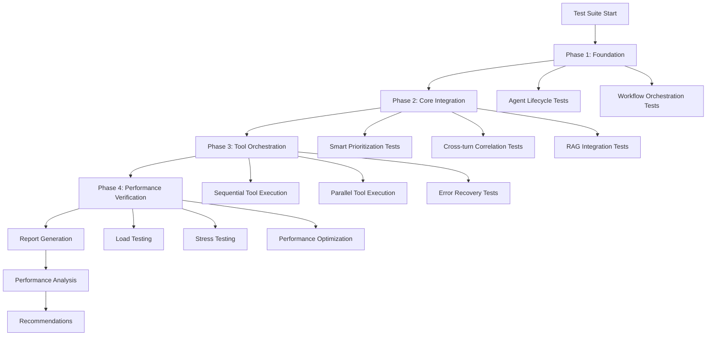

# Testing Documentation

Welcome to the comprehensive testing documentation for the ADK Agents system. This documentation covers the complete integration test suite designed following Google ADK integration testing patterns and best practices.

## Overview

The ADK Agents system features a sophisticated multi-agent architecture with comprehensive integration testing covering:

- **Agent Lifecycle Management** - Complete conversation turns with context management
- **Workflow Orchestration** - Sequential, parallel, iterative, and human-in-loop patterns
- **Advanced Context Management** - Smart prioritization, cross-turn correlation, and RAG integration
- **Tool Orchestration** - Complex tool coordination with error handling and recovery
- **Performance Verification** - Load testing, optimization validation, and stress testing

## Documentation Structure

### 📋 [Integration Testing Guide](integration-testing.md)
**The complete guide to running and understanding the integration test suite**

- Quick start instructions
- Test suite architecture and 4-phase implementation
- Test execution and result interpretation
- CI/CD integration and automation
- Performance monitoring and reporting

### 🔧 [Test Patterns and Best Practices](test-patterns.md)
**Comprehensive guide to test patterns and architectural decisions**

- Core test patterns (Agent Lifecycle, Workflow Orchestration, Context Management)
- Advanced testing patterns (Mock Strategy, Fixture Strategy, Performance Testing)
- Best practices for test organization and maintenance
- Anti-patterns to avoid and prevention strategies

### ⚡ [Performance Testing Guide](performance-testing.md)
**Specialized guide for performance testing and optimization**

- Performance test categories and metrics
- Load testing and stress testing patterns
- Performance monitoring infrastructure
- Optimization strategies and SLA validation
- Baseline management and regression testing

### 🛠️ [Troubleshooting Guide](troubleshooting.md)
**Comprehensive troubleshooting and debugging guide**

- Common issues and solutions
- Debugging techniques and tools
- Error recovery strategies
- Prevention and maintenance strategies
- Quick reference and support resources

## Quick Start

### Running the Test Suite

```bash
# Run all integration tests
./tests/integration/run_integration_tests.py

# Run with detailed output
./tests/integration/run_integration_tests.py --verbose

# Run in parallel mode (faster)
./tests/integration/run_integration_tests.py --parallel

# Run specific test suites
./tests/integration/run_integration_tests.py --suite "Foundation"
./tests/integration/run_integration_tests.py --suite "Performance"
```

### Test Results

Tests generate comprehensive reports in `test_reports/` including:
- Detailed execution results with timings
- Performance metrics and resource usage
- Error analysis and recommendations
- JSON reports for automation integration

## Test Suite Statistics

### Test Coverage
- **Total Integration Tests**: 57+
- **Test Files**: 5
- **Test Categories**: 4 phases
- **Performance Tests**: 16+
- **Mock Components**: 15+

### Test Phases
1. **Foundation Tests** (8 tests) - Agent lifecycle and workflow orchestration
2. **Core Integration Tests** (15 tests) - Context management and RAG integration
3. **Tool Orchestration Tests** (18 tests) - Advanced tool coordination
4. **Performance Verification** (16 tests) - Load testing and optimization

## Key Features

### 🎯 **Comprehensive Coverage**
- Complete agent lifecycle testing
- All workflow pattern validation
- Advanced context management testing
- Tool orchestration with error handling
- Performance and scalability testing

### 🔧 **Advanced Mocking**
- Realistic LLM client simulation
- Multi-agent session state management
- Tool execution behavior mocking
- Performance monitoring simulation

### 📊 **Performance Monitoring**
- Real-time resource tracking
- Memory leak detection
- CPU and throughput monitoring
- Token processing performance
- Concurrent user simulation

### 🛡️ **Error Handling**
- Comprehensive error scenario testing
- Automatic recovery validation
- Retry logic verification
- Fallback strategy testing
- State consistency validation

### 🚀 **Optimization**
- Parallel test execution
- Cached test data and fixtures
- Efficient resource utilization
- Smart test prioritization
- Performance baseline management

## Architecture Overview

### Test Organization

```
tests/
├── integration/
│   ├── test_agent_lifecycle.py          # Agent lifecycle and workflow tests
│   ├── test_context_management_advanced.py  # Advanced context management
│   ├── test_tool_orchestration_advanced.py  # Tool coordination tests
│   ├── test_performance_verification.py     # Performance and load tests
│   └── run_integration_tests.py            # Comprehensive test runner
├── fixtures/
│   └── test_helpers.py                  # Mock utilities and fixtures
└── conftest.py                          # Pytest configuration
```

### Core Components

#### Context Management
- **Smart Prioritization** - Content relevance scoring
- **Cross-turn Correlation** - Conversation relationship detection
- **Intelligent Summarization** - Context-aware content reduction
- **RAG Integration** - Semantic search with ChromaDB

#### Workflow Orchestration
- **Sequential Workflows** - Step-by-step dependency management
- **Parallel Workflows** - Concurrent execution optimization
- **Iterative Workflows** - Feedback loop handling
- **Human-in-Loop** - Approval and intervention points

#### Tool Orchestration
- **Dependency Management** - Tool execution order coordination
- **Error Recovery** - Automatic retry and fallback strategies
- **State Management** - Consistent state across tool executions
- **Performance Optimization** - Parallel vs sequential execution

## Test Execution Patterns

### Google ADK Integration Patterns

The test suite follows Google ADK integration testing patterns:

1. **Agent Development Kit (ADK) Patterns**
   - Multi-agent conversation testing
   - Context management across agents
   - Tool coordination and state sharing
   - Performance under concurrent load

2. **Gemini Integration Patterns**
   - Realistic LLM interaction simulation
   - Token counting and optimization
   - Content generation and processing
   - Error handling and recovery

3. **Production Readiness Patterns**
   - Scalability testing under load
   - Resource utilization monitoring
   - Performance SLA validation
   - Comprehensive error scenario coverage

### Test Execution Flow



## Best Practices Summary

### Test Development
- Follow the 4-phase test structure
- Use descriptive test names and documentation
- Implement proper fixtures and mocking
- Validate both success and failure scenarios

### Performance Considerations
- Use parallel execution where possible
- Monitor resource usage during tests
- Set appropriate timeouts and thresholds
- Profile and optimize slow tests

### Maintenance
- Keep tests synchronized with system changes
- Review and update mocks regularly
- Monitor test execution times and performance
- Document new patterns and lessons learned

## Integration with Development Workflow

### Continuous Integration
- Automated test execution on pull requests
- Performance gate validation
- Test result reporting and notifications
- Failure analysis and debugging support

### Development Support
- Local test execution for rapid feedback
- Debugging tools and techniques
- Performance profiling and optimization
- Test-driven development patterns

## Getting Started

### For New Developers
1. **Read the [Integration Testing Guide](integration-testing.md)** for comprehensive overview
2. **Review [Test Patterns](test-patterns.md)** to understand architectural decisions
3. **Run the test suite** locally to verify environment setup
4. **Explore test code** to understand implementation patterns

### For Test Developers
1. **Study existing test patterns** in the test suite
2. **Follow the [Test Patterns Guide](test-patterns.md)** for new tests
3. **Use the [Performance Testing Guide](performance-testing.md)** for performance tests
4. **Refer to [Troubleshooting Guide](troubleshooting.md)** when issues arise

### For System Administrators
1. **Set up CI/CD integration** using provided examples
2. **Configure performance monitoring** and alerting
3. **Establish baseline metrics** for performance gates
4. **Monitor test execution** and resource usage

## Contributing

### Adding New Tests
1. Follow established test patterns
2. Use appropriate fixtures and mocks
3. Include performance considerations
4. Update documentation as needed

### Improving Performance
1. Profile test execution to identify bottlenecks
2. Optimize slow tests where possible
3. Add performance tests for new features
4. Update performance baselines

### Documentation Updates
1. Keep documentation synchronized with code changes
2. Add troubleshooting entries for new issues
3. Update examples and patterns
4. Share knowledge with the team

## Support and Resources

### Internal Resources
- **Test Reports**: `test_reports/` directory
- **Test Logs**: Generated during test execution
- **Performance Metrics**: Included in test reports
- **Configuration Files**: In `tests/` directory

### External Resources
- **Google ADK Documentation**: For integration patterns
- **Pytest Documentation**: For test framework features
- **AsyncIO Documentation**: For async testing patterns
- **Performance Monitoring**: For resource tracking

## Future Enhancements

### Planned Improvements
- Enhanced performance monitoring
- Additional test patterns and scenarios
- Improved error analysis and reporting
- Extended CI/CD integration features

### Feedback and Suggestions
- Report issues and bugs through standard channels
- Suggest improvements to test coverage
- Share new patterns and best practices
- Contribute to documentation improvements

---

**Next Steps:** Start with the [Integration Testing Guide](integration-testing.md) to understand the complete test suite, then explore specific areas based on your needs. 