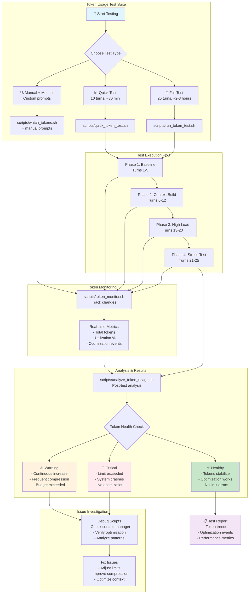

# Token Usage Testing Suite

This directory contains comprehensive tools for testing token usage optimization during long conversations with the DevOps agent.

## 🎯 Purpose

Identify and validate:
1. **Token optimization failures** - input tokens not decreasing over time
2. **Max token limit handling** - behavior when approaching/exceeding limits  
3. **K8s troubleshooting resilience** - complex scenarios that stress token usage

## 📁 Test Files

- **`token_usage_tracking_test.md`** - Detailed test specifications and methodology
- **`test_prompt_engineering.md`** - Original prompt engineering validation tests

## 🛠️ Test Scripts

### Core Scripts
- **`scripts/run_token_test.sh`** - Full comprehensive test (25 turns, ~2-3 hours)
- **`scripts/quick_token_test.sh`** - Quick validation test (10 turns, ~30 minutes)
- **`scripts/token_monitor.sh`** - Token monitoring utilities
- **`scripts/analyze_token_usage.sh`** - Post-test analysis tools
- **`scripts/watch_tokens.sh`** - Real-time token monitoring

## 🚀 Quick Start

### 1. Run Quick Test (Recommended)
```bash
# Run a 10-turn test to quickly validate token optimization
./scripts/quick_token_test.sh
```

### 2. Manual Testing with Real-time Monitoring
```bash
# Terminal 1: Start real-time monitoring
./scripts/watch_tokens.sh

# Terminal 2: Run manual prompts
./prompt.sh "Your test prompt here"
```

### 3. Full Comprehensive Test
```bash
# Run the complete 25-turn test suite
./scripts/run_token_test.sh
```

## 📊 Understanding Results

### Healthy Token Optimization Signs
```
✅ Input tokens stabilize after turn 8
✅ Total usage stays below 80% of limit
✅ Context compression triggers automatically
✅ No "token limit exceeded" errors
```

### Warning Signs
```
⚠️  Input tokens continuously increase
⚠️  Total tokens approach 100% without optimization
⚠️  Frequent budget exceeded warnings
⚠️  Context gets completely stripped
```

### Critical Failures
```
🚨 "Token limit exceeded" errors
🚨 System crashes during K8s scenarios
🚨 Input tokens never decrease
🚨 Unresponsive under token pressure
```

## 📈 Analyzing Results

### Quick Analysis
```bash
# Get latest test results
ls -la /tmp/token_usage_*.log /tmp/quick_token_test_*.log

# Analyze specific test
./scripts/analyze_token_usage.sh /tmp/token_usage_TIMESTAMP.log

# Check for critical issues
grep -E "CRITICAL|WARNING|ERROR" /tmp/token_test_execution_*.log
```

### Detailed Investigation
```bash
# Check agent logs
tail -100 /var/folders/*/T/agents_log/agent.latest.log

# Look for optimization events
grep -E "(Further Compression|Context Assembly|EXCLUDED)" /var/folders/*/T/agents_log/agent.latest.log

# Monitor token trends
grep "Total Used:" /tmp/token_usage_*.log
```

## 🧪 Test Phases

### Phase 1: Baseline (Turns 1-5)
- Simple queries to establish baseline
- **Expected**: Gradual token increase

### Phase 2: Context Accumulation (Turns 6-12)  
- Multi-file analysis and documentation review
- **Expected**: Token optimization begins

### Phase 3: High-Load (Turns 13-20)
- K8s troubleshooting scenarios
- **Expected**: Heavy optimization, stable tokens

### Phase 4: Stress Test (Turns 21-25)
- Complex multi-system analysis
- **Expected**: Aggressive optimization, possible compression

## 🔍 Common Issues & Solutions

### Issue: Tokens Keep Increasing
```bash
# Check if context optimization is working
grep "Further Compression" /var/folders/*/T/agents_log/agent.latest.log

# Verify context manager configuration  
grep "ContextManager.*initialized" /var/folders/*/T/agents_log/agent.latest.log
```

### Issue: Token Limit Exceeded
```bash
# Find when limit was hit
grep "token limit exceeded" /var/folders/*/T/agents_log/agent.latest.log

# Check context assembly details
grep -A 20 "CONTEXT ASSEMBLY" /var/folders/*/T/agents_log/agent.latest.log | tail -1
```

### Issue: Context Getting Stripped
```bash
# Check optimization aggressiveness
grep "EXCLUDED.*budget" /var/folders/*/T/agents_log/agent.latest.log

# Verify token counting accuracy
grep "Using.*token.*counter" /var/folders/*/T/agents_log/agent.latest.log
```

## 📋 Test Scenarios

### K8s Troubleshooting Scenarios
The test includes realistic Kubernetes troubleshooting scenarios that typically consume many tokens:

- Cluster health analysis
- Pod status investigation  
- Resource usage analysis
- Service mesh debugging
- Multi-application issue resolution
- Log analysis across services
- Configuration auditing
- Security assessments

### Token Pressure Points
These scenarios are designed to stress-test token optimization:

- Multiple file analysis
- Large documentation review
- Complex infrastructure audits
- Historical change analysis
- Multi-environment comparisons

## 🎛️ Customization

### Modify Test Prompts
Edit the `PROMPTS` array in test scripts to customize scenarios:

```bash
# Edit quick test
vim scripts/quick_token_test.sh

# Edit full test  
vim scripts/run_token_test.sh
```

### Adjust Monitoring
Modify token monitoring frequency or metrics:

```bash
# Edit monitoring script
vim scripts/watch_tokens.sh

# Change monitoring interval (default: 2 seconds)
sleep 2  # Change this value
```

### Custom Analysis
Add custom analysis patterns:

```bash
# Edit analysis script
vim scripts/analyze_token_usage.sh

# Add custom grep patterns for your specific issues
```

## 📝 Contributing

When adding new test scenarios:

1. **Focus on token-heavy operations** - file analysis, documentation review, K8s debugging
2. **Test optimization edge cases** - scenarios that might break context compression
3. **Include realistic workflows** - actual tasks users perform with the agent
4. **Document expected behavior** - what should happen with tokens in each scenario

## 🚨 Emergency Procedures

### If Test Causes System Issues
```bash
# Kill running tests
pkill -f token_test
pkill -f prompt.sh

# Check system resources
top | head -20

# Clear temporary logs
rm -f /tmp/token_*
```

### If Agent Becomes Unresponsive
```bash
# Check agent processes
ps aux | grep adk

# Check log file size
ls -lh /var/folders/*/T/agents_log/

# Restart agent (if needed)
# Follow your normal agent restart procedures
```

This testing suite provides comprehensive validation of token optimization behavior and helps identify issues before they impact production usage. 

